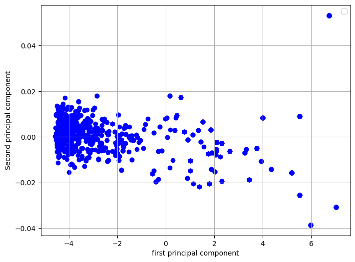
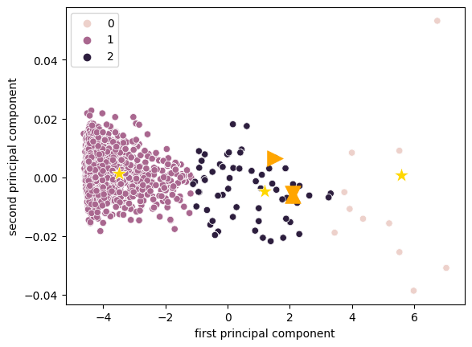
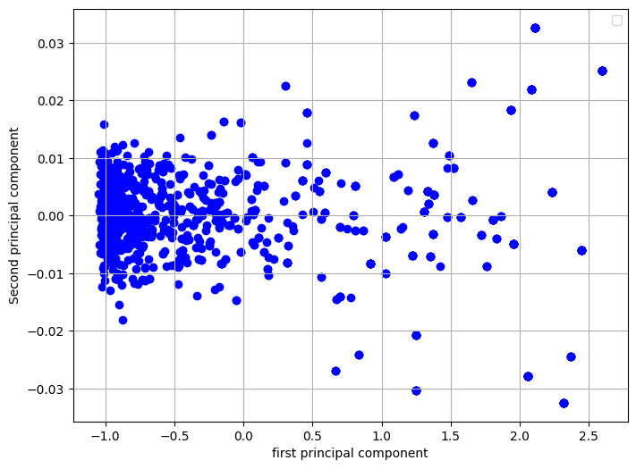
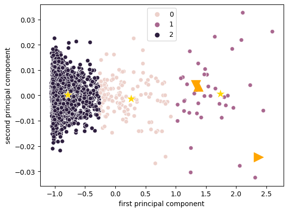
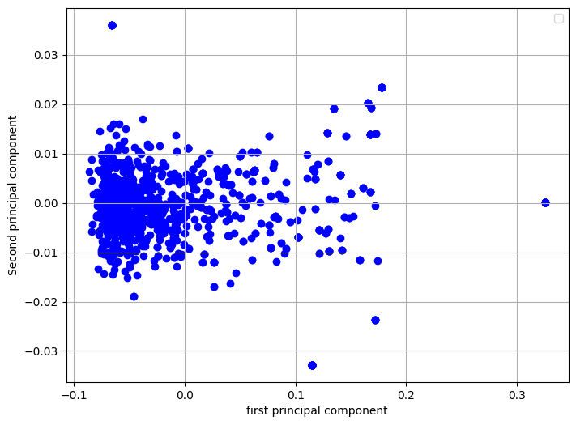
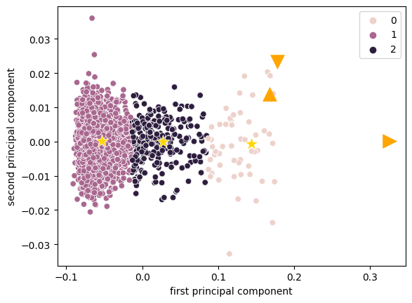

```python
#インポート
!pip install --upgrade gensim
from gensim.models import word2vec
from nltk.stem.porter import PorterStemmer as PS
import numpy as np
import pandas as pd
import matplotlib.pyplot as plt
from sklearn.decomposition import PCA
from matplotlib import pyplot as plt
import random
from sklearn.cluster import KMeans
import seaborn as sns
```

    Requirement already satisfied: gensim in /usr/local/lib/python3.10/dist-packages (4.3.1)
    Requirement already satisfied: numpy>=1.18.5 in /usr/local/lib/python3.10/dist-packages (from gensim) (1.22.4)
    Requirement already satisfied: scipy>=1.7.0 in /usr/local/lib/python3.10/dist-packages (from gensim) (1.10.1)
    Requirement already satisfied: smart-open>=1.8.1 in /usr/local/lib/python3.10/dist-packages (from gensim) (6.3.0)
    


```python
#マウント
from google.colab import drive
drive.mount('/content/gdrive')
%cd /content/gdrive/MyDrive/検索技術
```

    Drive already mounted at /content/gdrive; to attempt to forcibly remount, call drive.mount("/content/gdrive", force_remount=True).
    /content/gdrive/MyDrive/検索技術
    


```python
#前処理
def preprocess(text,eliminate=0):
  text=text.lower()       #小文字化
  text=text.replace('.','')     #以下で記号と単語の間にスペースを挿入したり削除したりする。
  text=text.replace(',','')
  text=text.replace('\n','')
  text=text.replace('\t',' ')
  text=text.replace('(','')
  text=text.replace(')','')
  text=text.replace('!','')
  text=text.replace('?','')
  text=text.replace('"','')
  words=text.split(' ')   #スペースで区切り、リスト化する
  ps = PS()       #ステミングのためのインスタンス作成
  words_s=[]
  i=0
  for token in words:
    token=ps.stem(token)    #1単語ごとにステミング
    if eliminate:     #デフォルトでfalse、リストが来たら以下を実行
      if token in eliminate:    #単語が除外リストに含まれているならappendしない

        continue
      else:
        words_s.append(token)   #それらをリストに格納
    else:
      words_s.append(token)
  return words_s
```


```python
#Word2Vecの処理を行う関数
def make_word_matrix(path,eliminate=0):
  sentences=[[]]
  c=[]
  with open(path,'r',encoding='utf-8') as f:
    i=0
    for line in f:
      sentence=[]
      sentence=preprocess(line,eliminate)
      sentences.append(sentence)

  sentences.pop(0)    #先頭に謎の空の配列が入ってしまうのでそれを消す

  model = word2vec.Word2Vec(sentences, vector_size=100, window=10, min_count=1)

  w_list=[]
  matrix=np.empty((0,100))
  for words in sentences:
    for word in words:
      w_list.append(word)
      vector = model.wv[word]
      matrix = np.vstack([matrix, vector])

  return matrix,w_list
```


```python
def get_vec(matrix,w_vec,target): #targetの単語のベクトルを得る関数
  i=0
  for word in w_vec:
    if word==target:
      vec=matrix[i]
      return vec
    i+=1
  print("no such word")
```


```python
#PCAを行う関数
def do_pca(matrix):
  pca = PCA(n_components=2)
  pca.fit(matrix)
  transformed = pca.fit_transform(matrix)

  ran= random.sample(range(0, matrix.shape[0]-1), 1000)    #1000に直す

  plt.figure(figsize=(8, 6))
  for i in range(transformed.shape[0]):
    if i in ran:
      x, y = transformed[i, 0], transformed[i, 1]
      plt.scatter(x, y, marker='o',color='blue')

  # グラフの設定
  plt.xlabel('first principal component')
  plt.ylabel('Second principal component')
  # plt.title('Scatter Plot of 1000x2 Matrix')
  plt.legend()
  plt.grid(True)

  # グラフを表示
  plt.show()
  # np.set_printoptions(threshold=np.inf)
  # print(transformed)
  print('各次元の寄与率: {0}'.format(pca.explained_variance_ratio_))
  print('累積寄与率: {0}'.format(sum(pca.explained_variance_ratio_)))

  return transformed
```


```python
#k-means法でクラスタリングする関数
def clustering(transformed,w_list,display=False):  #次元圧縮したベクトルの行列、単語リスト、除外リストを作るor作らない、
                                                        #各クラスターの内容を表示するorしない、除外リストのキー
  model2 = KMeans(n_clusters=3, random_state=0)
  model2.fit(transformed)
  clusters = model2.predict(transformed)  # データが属するクラスタのラベルを取得
  # ターゲットの座標を取得
  target1=get_vec(transformed,w_list,'noguchi')
  target2=get_vec(transformed,w_list,'ito')
  target3=get_vec(transformed,w_list,'soseki')

  # クラスター重心の座標を取得
  df_cluster_centers = pd.DataFrame(model2.cluster_centers_)
  df_cluster_centers.columns = ['first principal component', 'second principal component']
  print(df_cluster_centers)

  df = pd.DataFrame(transformed, columns=['first principal component', 'second principal component'])
  df['class'] = clusters

  # クラスタリングデータをプロット
  sns.scatterplot(data=df, x='first principal component', y='second principal component', hue='class')
  # クラスター重心をプロット
  sns.scatterplot(data=df_cluster_centers, x='first principal component', y='second principal component', s=200, marker='*', color='gold', linewidth=0.5)
  # ターゲットの点をプロット
  plt.scatter(target1[0], target1[1],s=200, marker='^', color='orange', linewidth=0.5)
  plt.scatter(target2[0], target2[1],s=200, marker='>', color='orange', linewidth=0.5)
  plt.scatter(target3[0], target3[1],s=200, marker='v', color='orange', linewidth=0.5)
  # 描画
  plt.show()
  set0=set()
  set1=set()
  set2=set()

  for i in range(len(clusters)):
    if clusters[i]==0:
      set0.add(w_list[i])
    elif clusters[i]==1:
      set1.add(w_list[i])
    else:
      set2.add(w_list[i])

  if display:
    print(set0)
    print(set1)
    print(set2)

  set_list=[set0,set1,set2]

  return set_list
```


```python
def define_eliminate_set(list,key):
  if key in list[0]:
    return list[0]
  elif key in list[1]:
    return list[1]
  elif key in list[2]:
    return list[2]
  else:
    print("no such word")
    return
```


```python
#main
path='./raw_text3.txt'
eliminate_set=set()
word_matrix,word_list=make_word_matrix(path)
transformed_matrix=do_pca(word_matrix)
cluster=clustering(transformed_matrix,word_list,True)
```

    WARNING:matplotlib.legend:No artists with labels found to put in legend.  Note that artists whose label start with an underscore are ignored when legend() is called with no argument.
    


    

    


    各次元の寄与率: [9.99776776e-01 1.99172989e-05]
    累積寄与率: 0.9997966930299977
    

    /usr/local/lib/python3.10/dist-packages/sklearn/cluster/_kmeans.py:870: FutureWarning: The default value of `n_init` will change from 10 to 'auto' in 1.4. Set the value of `n_init` explicitly to suppress the warning
      warnings.warn(
    

       first principal component  second principal component
    0                   5.598052                    0.000863
    1                  -3.488146                    0.001301
    2                   1.199643                   -0.004642
    


    

    


    {'with', 'hi', 'in', 'of', 'the', 'and', 'a', 'as', 'wa', 'he', 'to'}
    {'', 'misao', 'point', 'hand', 'ki', 'serolog', 'central', 'proceed', 'happi', 'everi', 'denounc', "keppen'", 'commod', 'author', "chie'", 'scene', 'shofukai', 'shonosuk', 'zhao', 'carbin', 'jay', 'pursu', 'adjac', '25th', 'darg', '1881', 'red', 'keenli', 'autumn', 'fulfil', 'ship', 'realiz', 'limit', 'sail', 'fishermen', 'cours', "kikkawa'", 'vomit', 'kawashima', 'pillar', 'news', 'toshiyuki', 'descript', 'kesaki', 'hit', 'reorder', 'bookstor', 'power', 'tohoku', 'shohei', 'give', 'dementia', 'obviou', 'komagom', 'studio', 'toshio', 'recognit', 'differ', 'carv', 'partli', 'telegram', 'recogn', 'occas', 'here', 'asahi', 'circumst', 'annot', 'bacteri', 'kai', 'chie', 'cheer', 'redon', 'brain', 'trial', 'ridg', 'onc', 'conceal', 'enact', '21st', 'kogoro', 'prussian', 'blame', 'heart', '22', 'british-styl', 'ecuador', 'nationalist', 'sash', 'showa', 'gakko', 'u', 'loan', 'mind-boggl', 'yozo', 'ground', 'tomokuma', 'depart', 'kibeitai', '1894', 'plan', 'declar', 'permiss', 'appeas', 'view', 'ryokan', 'oppos', "kinnosuke'", 'skeptic', 'mr', 'corp', 'gain', 'takadanobaba', 'mind', '-oct', '36th', 'cling', 'nitta', 'favor', 'phrase', '20th', 'kondo', '18', 'music', 'did', 'brave', 'lender', 'toyo', '1919', 'plot', 'senat', '15', 'founder', 'unsatisfactori', 'husband', 'council', 'benefit', 'institut', '1937', 'pastor', 'chu', 'flung', 'nojiri', 'gojong', 'gakushuin', 'offer', 'legal', 'postwar', "father'", 'kihachiro', 'banshu', 'kohei', 'kaneko', 'peru', 'sister', 'virtual', 'aliv', 'most', 'chap', 'eurocentr', 'els', 'uncomfort', 'derogatori', 'sayosuk', 'mild', 'honesti', 'earthquak', 'full-length', 'habit', 'pair', 'thereaft', 'shoukasonjuku', 'seisei', 'amus', 'guy', 'shinjuku', 'interest', 'judici', 'insid', 'sanzan', 'claim', 'attempt', 'nightcloth', 'eas', 'eye', 'fifth', 'woo', '5', 'grandpar', 'ph', 'kokoro', 'bombard', 'miki', 'perhap', 'unabl', 'vicin', 'legitim', 'watsuji', 'yamauchi', 'record', 'shibasaburo', 'lodg', 'third-rat', 'ink', 'subject', 'toshima-gun', 'contributor', 'jang', 'dormitori', 'schedul', 'audienc', 'sold', 'grandchild', 'komiya', 'elit', 'isol', 'style', 'enter', 'how', '1895', 'liber', 'kojuro', 'tomorrow', '1841', 'tribe', 'morinosuk', 'nagahama', 'prison', 'sato', 'sukeinikai', 'crossfir', 'extens', 'cancel', 'call', 'fraudul', 'parent', '俊輔', "lord'", 'intak', 'kinnosuk', 'takashi', 'kenko', 'shiba', 'acquaint', 'occur', 'recept', 'announc', 'colonel', 'gaga', 'keio', 'worldwid', 'propos', 'oiso', 'coloni', 'smallpox', 'ooka', 'scienc', 'ill', 'consist', 'russo-japanes', 'veget', 'kojien', 'musician', 'cigar', 'microorgan', 'seibokko', 'denmark', 'experi', 'sakuradacho', 'belov', 'frequent', 'chancellor', 'wrote', 'signific', 'figur', 'hous', 'whom', 'hirofumi', 'collaps', 'yoshinari', 'kooshi', "girls'", 'mean-spirit', 'izu', 'charact', '1859', 'woman', 'sukari', 'corner', 'merchant', 'mat', 'pen', 'retrospect', '1884', 'cuban', 'danger', 'inocul', 'respect', 'yama-kai', 'section', 'tsunematsu', '4', 'six', 'land', 'entranc', 'fund-rais', 'yokohama', 'attorney', 'strip', 'cabinet', 'intox', 'cream', 'lament', 'toshima-ku', 'urban', 'clinician', 'opinion', 'far', 'academic', 'shunpo', 'spendthrift', 'juzo', 'truli', 'thief', 'bureaucrat', 'vacat', 'credit', 'derid', 'came', 'identifi', 'lord', 'thinker', 'low', 'mostli', 'spring', 'shimonoseki', 'narus', 'lunar', 'intellectu', 'lucki', 'mourn', 'peasant', 'noriten', 'ernest', 'acquisit', 'ugli', 'along', 'transit', 'yakichi', 'nacion', 'anti-biolog', 'way', 'invite', 'told', 'disabl', 'visit', 'sound', 'victor', 'popular', 'accomplic', 'floor', 'recent', 'sign', 'amount', 'fuji', 'microscop', 'clarifi', 'touch', 'earnest', 'railroad', 'patient/subject', 'geniu', 'whistl', 'anyway', 'licens', 'akiyama', "peasants'", 'bodi', 'moment', 'burial', 'government-suppli', 'sendagi-cho', 'torikichi', 'resum', 'stipul', 'african', 'agenc', 'md', 'without', 'awar', 'seriou', 'harmoni', 'hirata', 'declin', 'kokovtsov', 'oregon', 'ladi', 'greater', 'healthi', 'got', 'speaker', 'gotenyama', 'enabl', 'usa', 'kusaka', 'koishikawa', 'fukuhara', 'brilliant', 'obancho', 'sakago', 'hermitag', 'ashigaru', 'eccentr', 'ryunosuk', 'susan', 'complet', 'microbiolog', 'flu', 'town', 'kubo', 'gozo', 'silver', '1967', 'creation', 'jiji', 'hanafu', 'mosquito', 'nishogakusa', 'novemb', 'east', 'kawamura', "magistrate'", 'piec', 'back', 'charcoal', 'resembl', 'polem', 'job', 'borrow', 'girl', 'poor', 'gould', 'smoke', 'kunihira', 'tomotsun', 'shinagawa-ku', 'tube', 'noguchi-pap', 'monkey', 'hardli', 'ei', 'around', 'american', 'immun', 'behead', 'fund', 'kyoko', 'lent', 'templ', 'eifu', 'roosevelt', '1927', 'infect', '1870', 'anyth', 'bureau', 'ethic', 'harbin', 'reader', 'akashi', 'beefsteak', 'impur', 'bless', 'jam', 'discord', 'annual', 'directli', 'support', 'michikusa', 'crowdfund', 'shrine', '2005', 'honestli', 'head', 'satō', 'mt', 'particular', 'lift', 'effort', 'shoyo', 'toson', 'herald', 'present', 'up', 'eloqu', 'pulmonari', 'art', 'break', 'industri', 'suga', "university'", 'manner', 'combin', 'kwantung', 'medicin', 'eighth', 'prewar', 'mark', 'appear', 'masaki', 'constitution', 'sanwa-mura', '1897', 'greatest', 'sun', 'british', 'strongli', 'chore', 'stick', 'reign', 'dixon', 'upon', 'faculti', 'introduc', 'sugisugi', 'aid', 'hobbyist', 'daiichi', 'taken', 'top', 'masanosuk', 'etadera', 'intent', 'kanyin', 'ito-cho', 'servant', 'engakuji', 'increasingli', 'fee', 'shigeo', 'seikan', 'princ', 'uncl', 'two', '1', 'wanderlust', 'stake', 'graduat', 'seisaku', 'long', 'aftermath', 'enlarg', 'ushigome-babashita', 'waseda', 'relax', 'predecessor', 'web', '37', 'kou', 'sontag', 'jigoro', 'fill', 'set', 'prepar', 'remain', 'grass', 'surgeri', 'better', 'gyojin', 'calligraphi', 'someth', 'design', 'sentoin', 'kazuto', 'homogen', 'ask', 'commun', 'non-syphilit', 'gakusha', 'ting', 'drawn', 'goal', 'vitro', 'cement', 'major', 'aizu', 'shunsuk', 'struggl', 'noon', 'aiko', 'funer', '27', 'foundat', 'solv', '1991', 'anti-natur', 'divis', '1946', 'captur', 'propag', 'subordin', 'manchurian-korean', 'д', 'komura', 'akiko', 'mushanokoji', 'upbring', 'alreadi', 'creativ', 'rikishi-tai', 'open-mind', 'self-studi', 'would', 'variou', 'europ', 'abe', 'asham', 'ushigome-ku', 'help', 'earli', 'activ', 'negoti', 'cross', 'reput', 'middleman', 'shandaken', 'romantic', 'mari', 'kingston', 'inada', 'lima', 'yoshimon', 'tenur', 'upward', 'priorit', 'vienna', 'kotobuki-cho', 'qualifi', 'naniwabushi', 'travel', 'juli', 'kojiro', 'manag', 'never', 'accra', 'matheson', '1874', 'imagin', 'albeit', 'struck', 'appetit', 'premis', 'confer', 'room', 'world-renown', 'furui', 'kiwaki', 'koryo', 'shop', 'supervisor-gener', 'cat', 'possibl', 'each', 'coalit', 'need', 'skip', '4th', 'big', 'soft', 'obtain', 'ugoshin', 'river', 'attach', 'network', 'contin', 'diari', 'cultur', 'shikoku', 'viru', 'nishogakusha', 'hototogisu', 'lame', 'william', 'gengrandchild', 'task', 'side', 'shukan', 'prefectur', 'unearth', '1914', 'top-level', 'wide', 'tropic', 'formul', 'villa', '700', 'kubaki', 'rais', 'polit', 'momiji', 'preserv', "people'", 'ochi', 'grandson-in-law', 'naotan', 'received;', 'green', 'dozen', 'ansei', 'caught', 'build', 'rank', 'warn', 'canadian', 'kokusei', 'send', 'sarugaku-cho', 'diagnos', 'entir', 'kamakura', 'round', 'shed', 'article-by-articl', 'gudabutsu', 'finger', 'brothel', 'knew', 'nagai', 'while', 'pattern', 'colleg', 'bailiff', 'harusuk', 'guidanc', 'employ', 'provinc', 'naturalist', 'pertain', 'extract', 'repres', 'ancestor', 'method', 'protector', 'seal', 'gambl', 'babashita', 'teacher-stud', 'great', 'amoeb', 'knowledg', 'iemin', 'factor', 'gneist', 'editor-in-chief', 'attack', 'masatak', 'shosei', 'jutaro', 'ice', 'superstit', 'object', 'inscript', 'breakdown', 'vaccin', 'spender', 'pave', 'naoshi', 'spinal', 'toda', 'meredith', '100', 'true', 'forc', 'state', 'agubincho', 'thoroughli', 'organ', 'applic', '1882', "yamauchi'", 'semest', 'canal', 'urin', 'untreat', 'larg', "okura'", '29', 'saito', 'could', 'bill', 'elderli', 'historian', 'took', 'occup', 'satoshi', 'bacteria', 'introduct', 'yakumo', 'scholarship', 'osaka', 'junior', "weil'", '1898', 'happen', 'ulcer;', 'branch', 'characterist', 'reviv', 'fujimura', 'ha', 'engag', 'saw', 'nagasaki', '1876', 'dissatisfact', 'hirohashi', 'cloak', 'sueko', 'counti', 'caus', 'democrat', 'leptospira', 'lot', 'taiseikai', 'modern', 'comic', 'tell', 'plenipotentiari', 'toward', 'saisei', 'birthplac', 'interfer', 'till', 'miner', 'often', 'companion', 'mclain', 'version', 'secularist', 'mean', 'cautiou', 'arrest', 'discuss', 'nobil', 'western', 'polici', 'british-born', 'parti', 'stanc', 'russian', 'walk', 'battl', 'encourag', 'fear', "shoin'", 'repeatedli', 'dissolv', 'rice', 'e', 'depriv', 'code', 'mani', 'thunder', 'affect', 'kimono', "world'", 'rever', '1885', 'recov', 'factori', 'chikuma', 'synonym', 'hongo', 'sight', 'choshu', '45', 'theodor', 'noubun', 'chrysanthemum', 'ikeda', 'situat', 'gudabutsuan', 'though', 'manchuria', '314', 'well-known', 'finlay', 'massen', 'tsuda', 'wed', 'bucket', 'neighborhood', 'do', 'ota', 'toze', 'incident', 'workmanship', '1938', '100000', 'eiichi', 'decor', 'midwiferi', 'down', 'food', 'dental', 'nobuyo', "jiro'", 'filter', 'unoffici', 'tatami', '1984', 'ani', 'colleagu', 'poverti', 'allcock', 'dine', 'throw', 'casual', 'foreign', 'wakamatsu', 'heavi', 'rare', 'anyon', 'commentari', 'lunch', 'warehouseman', 'proof', 'cousin', 'incur', 'lesson', 'yet', 'own', 'asian', 'peer', "choshu'", 'maru', 'pistol', 'supernatur', 'car', 'russia', 'takachika', 'л', 'visibl', "children'", 'recommend', '315', 'peer-review', 'defens', 'displeas', 'suitabl', 'lung', 'error', '65', "jones'", 'wore', 'fugu', 'fellow', 'lack', 'person', '1922', 'right', 'bitter', 'sens', "patient'", 'liaison', 'bay', 'renam', 'conflict', 'poetic', 'newspap', 'camp', 'older', 'length', 'peac', 'worth', 'minami-cho', 'door', 'daikokuza', 'seika', 'mabel', "iwasaki'", 'inform', 'minut', 'hidesuk', 'fusanosuk', "asia'", 'regain', 'fatal', 'ezo', 'their', 'machado', 'ichiro', 'kiyonaga', 'visitor', 'luggag', 'han-man', 'matemi:', 'recit', 'wife', 'interact', 'percentag', 'camden', 'sanso', 'physiolog', 'confirm', 'rabi', 'hard-lin', 'amerika', 'ehim', 'yoshio', '1960', 'again', 'feudal', 'govern', 'dictionari', 'ten', 'dealer', 'postman', 'fold', 'ran', 'kinka', 'law;', 'trust', 'locu', 'administ', 'sashin', 'resent', 'inscrib', 'earn', 'strain', 'itself', 'epidem', 'absurd', 'imit', 'third', '1000-yen', 'salon-lik', 'gourmet', 'tone', 'readmiss', 'elect', 'japan-russia', 'friendship', 'initi', 'businessmen', 'hitotsu', 'yoshida', 'masao', 'arrang', 'answer', '1979', 'luck', 'kanji', 'outrag', '1000', 'fudeko', 'hanseong', 'seem', 'thank', 'advic', '1871', 'particularli', 'shaku', 'excel', 'secretari', 'bacterium', 'decis', 'victori', 'poorli', '571', 'gaibei', 'hinder', 'compil', '60th', 'reassign', 'sino-japanes', 'pronunci', 'simpl', 'marriag', 'torn', 'авпри', 'great-grandchild', 'biographi', 'engin', 'lend', 'second-', 'life', 'temporarili', 'link', 'reminisc', 'rang', 'achiev', 'drew', 'etern', 'mother', 'virtu', 'suffici', 'koubunsha', '34', 'well', 'refer', '175', 'note', "yakumo'", 'tatsukichi', 'psychiatrist', 'highli', 'so-cal', 'tetsuzo', 'seek', 'ichichu', 'lavishli', 'aha', 'grave', 'muscular', 'home', 'unaccept', 'tokuda', 'hatamoto', '72', 'thousand', 'reed', 'kodo', 'pro-japanes', "noguchi'", 'rejoic', 'clear', 'kage', 'distort', 'merg', 'shibusawa', '11th', 'inject', 'chunpanro', 'overnight', 'mitsuo', 'statement:', 'kanagawa', 'fame', 'kogaku', 'nakayama', '11', 'takeo', '1889', 'collect', 'will', "takamori'", 'utterli', '14', 'tsukita', 'dislik', 'plate', 'night', '53', 'icteloid', 'influenti', 'sea', "hori'", 'allow', 'octob', '26', 'ichigaya', 'talk', 'me', 'chemistri', 'shift', 'blow', 'england', 'than', 'grow', 'himika', 'chide', 'republ', 'portsmouth', 'stay', 'fourth', 'pound', 'strang', 'shadow', 'tool', 'discipl', 'okura', 'doe', 'matsui', "that'", '（he', 'ethanol', 'diabet', 'inclus', 'grace', 'platzhofen', '80', 'higashi', 'misplac', 'fulli', 'exampl', '40th', 'surrey', '1425', 'heir', 'edit', 'psychiatr', 'goe', 'still', 'bottl', 'below', 'fine', 'subsequ', 'bungei', 'pathologist', 'media', 'radio', 'faction', 'resign', 'syphilit', 'tokogo-takasugi-kun', 'tax', '26th', 'run', 'suke', 'extrem', 'fortun', 'admonish', 'hopeless', 'literatur', 'import', 'compet', 'consensu', 'oil', 'ungrac', 'monthli', 'tast', 'inawashiro', 'welcom', 'german-styl', 'sanshiro', 'day', 'politician', 'classroom', 'assign', 'pillow', 'williamson', 'rubin', 'alli', 'buraku', 'water', 'ordin', 'monogatari', 'breez', 'jame', 'wholesal', 'locat', 'up-and-com', 'wonder', "greene'", 'three', 'drunkard', "japan'", 'full-fledg', 'jomon', 'usagi', 'yamao', 'coeruleu', 'endo', 'reoper', 'sica', 'church', 'someon', 'line', 'blind', 'kowakatō', 'mexico', 'urgent', 'kyoiku', 'switch', 'ni', 'riot', 'youngest', '1865', 'unusu', 'cite', 'real', 'kagamiko', 'tsuneko', 'guid', 'citi', 'gapsin', 'nikon', 'apart', 'rosett', 'detain', 'ujimasa', 'sourc', 'four', 'inawashiro-cho', 'finish', 'cent', 'kimimochi', 'ailment', 'saneatsu', 'ostens', 'hata', 'civil', 'treat', 'rinnosuk', 'nearli', 'should', 'comprehens', 'vita', 'prize', 'hurriedli', 'dialect', 'garaku', 'kimochi', 'kusunoki', 'kaoru', 'haiku', '1863', '7-round', 'naonori', 'virus', 'professor', 'purpos', 'glaze', 'past', 'reloc', 'controversi', 'law', 'princip', 'wealthi', 'san', 'abil', 'watab', "governor'", 'torao', 'spell', 'flesh', 'post', 'kikui-cho', 'award', 'associ', 'minato', 'restaur', 'eight', 'discriminatori', 'paralysi', 'friend', '10', 'draft', 'expuls', 'trahom', 'rheumat', 'hideo', 'pennsylvania', 'iwakura', 'guard', 'diplomat', 'gun', 'model', 'roland', 'celsiu', 'tuberculosi', 'drop', '1963', 'armi', 'noguchi-san', 'dr', 'clan', 'agenda', 'thought', 'bakan', 'japanes', 'pour', 'von', 'wish', 'replac', 'janitor', 'five', "shinroku'", 'tsugishig', 'argument', 'yama-gun', 'manuscript', 'fever-lik', 'respons', 'umbil', 'project', 'hunger', 'indiffer', '800000', 'accord', 'lagoon', 'superior', 'hot', 'ozaki', 'english-speak', 'makuraryu', 'outbreak', 'max', 'sanwa', 'torahiko', 'kusamakura', "tatsuno'", 'injur', 'mataro', 'made', 'anemia', 'scandal', 'stop', 'abolit', 'gener', 'standard', 'kansai', 'formerli', 'kiyoshi', 'foreseen', 'driven', 'month', 'handicap', 'hour', 'blood', 'cm', 'behavior', 'shobo', 'stronger', 'okurayama', 'protest', 'hope', 'sexagenari', 'moral', 'memori', 'genzui', 'song', 'earlier', 'problemat', 'nightgown', 'sent', 'defici', 'treatment', 'our', 'promulg', 'photo', 'half-sist', '1913', 'togeth', '1867', 'messag', 'voic', 'pleasur', 'use', 'vassal', 'shinsaku', 'toshisuk', 'critiqu', 'debt', 'morita', 'pure', "shakespeare'", 'shinbashi', 'return', 'kagiya', 'safe', 'moss', 'clinic', 'much', 'incorpor', 'yoshinobu', 'local', 'yushima', 'secretli', 'nogami', 'demonstr', 'emplac', 'privat', 'inferior', 'submit', 'valu', 'accept', '6', 'soon-to-be-found', 'botsukuchiyan', 'yoshikawa', 'hottogisu', 'feel', '1902', 'fool', 'traumat', 'adjud', 'dynasti', 'number', 'hideyo', 'charg', 'fleet', 'tongak', 'into', 'issu', 'panama', 'оп', 'termin', 'nicknam', 'nakagawa', 'ochanomizu', 'fruit', 'sumi', 'basi', 'more', 'spread', "china'", 'mouth', 'background', 'rain;', 'wealth', 'append', 'pact', 'shinto', 'kaku', '17', 'foot', 'prefer', 'match', 'soon', 'astonish', 'nisshogakusa', 'pass', 'dicken', 'naka', 'seoul', 'piggott', 'confid', 'watanab', 'kuroda', 'adopt', 'activist', 'these', "natsume'", 'usag', 'deputi', 'journalist', 'africa', 'delight', 'stuck', 'receiv', 'broomstick', 'yukichi', 'fukushima', 'copenhagen', 'kodokan', 'kumag', 'babi', 'cangan-kaku', 'young', 'thu', 'seifu', 'select', 'destroy', 'beyond', '#1', 'forbidden', 'bacteriologist', 'children', 'октября', 'distinguish', 'crest', 'constantli', 'concern', 'old', 'lambeth', 'freeli', 'quotat', 'destin', 'qing', '1909', 'mitsubishi', 'nation', 'director', 'chef', 'reopen', 'piti', 'genichiro', 'gatakiu', 'exclud', 'fix', 'sukun', 'raman', 'unconsci', 'yomiuri', 'behind', 'nyoseki', 'monument', 'away', 'vast', 'guangxu', 'buri', 'tour', 'know', 'chosun', 'leader', 'distant', 'takebei', 'question', 'contrast', 'cafeteria', 'indebt', 'albert', 'eisei', 'short', 'persist', 'peculiar', "stone'", 'academia', 'fukuchi', 'cudamichi', 'ebara-gun', 'aizu-wakamatsu', 'smooth', 'kyoshi', 'ushigom', 'type', "bälz'", '1854', 'conclud', 'sever', '1893', 'patienc', 'bust', 'pugenkusa', '-august', 'captain', 'won', 'councilor', '2004', 'german', 'self-indulg', 'spirit', 'kume', "today'", 'skin', 'ascent', '51', 'counselor', 'curio', 'amanoya', 'hirokuni', 'deleg', 'come', '1998', "rubin'", 'hundr', 'all', 'relationship', 'minist', 'report', 'dentist', 'identif', 'some', 'agreement', 'koka', 'blown', 'let', 'midnight', 'shuzenji', 'we', 'spite', 'tsusu', 'bengyo', 'enjoy', 'teisho', 'data', "emperor'", 'dare', 'neg', 'kind', 'where', 'iwasaki', 'kumamoto', 'broadcast', 'repatri', 'off', 'show', 'femal', 'futur', 'emerg', 'коковцов', 'son-in-law', 'schoolmat', 'poet', 'yamagata', "eto'", 'money', 'can', 'consumm', 'find', 'tetsuta', 'formal', 'forget', 'both', 'persuad', 'keep', 'bälz', "iida'", 'surviv', 'motoda', 'souhei', 'paint', 'easi', 'symptom', 'consent', 'london', 'station', 'cao', 'metaphor', 'trilog', 'attent', 'maemitsu', '21', 'actual', 'think', 'anti-vivisect', 'ryotei', 'kikuya', 'hei', 'virul', 'transform', 'unpopular', 'fabl', 'dedic', 'rush', 'request', 'retort', 'digit', 'misaoi', 'enforc', 'educ', 'kozanji', '30', 'naoki', 'provid', 'senuma', 'prevent', 'takano', 'reason', 'count', 'aspir', 'mood', 'autopsi', 'onigawara', 'today', 'requir', 'product', 'duke', 'ban', '28th', 'sadden', 'lightning;', 'independ', 'coupl', 'cloth', 'repeat', 'scar', 'individu', 'naokatsu', 'nishi-koiso', 'realiti', 'believ', '1877-1886', 'total', 'infecti', '1879', 'discoveri', 'bereav', 'oi', 'kusshu', 'vulner', 'instead', 'monetari', 'stroll', 'sampl', 'plagu', '16-year-old', 'hold', 'felix', 'righteou', 'rikken', 'barrist', 'abov', 'monarchi', 'flagel', 'likelihood', 'tsubouchi', "okubo'", 'endors', 'likeabl', 'jurist', 'until', 'rememb', 'crown', 'kiyotaka', 'advantag', 'establish', 'suicid', 'fair', 'check', '1928', "institute'", 'seneg', 'high', '1926', 'south', 'yanagibashi', '1m62', 'heard', 'shigekazu', 'li', 'debaucheri', 'stone', 'focus', 'margin', 'kakonin', 'child', 'nanakusa-shu', 'hinomaru', 'wilson', 'foreshadow', 'split', 'kun-ichi', 'memo', 'chiyoda', 'hirakawa', 'classif', 'unlucki', 'iwanai-gun', 'toshimaro', 'soen', '1875', 'taito', 'taro', 'remaind', 'februari', 'jone', 'pleas', 'galleri', 'rudolf', 'approach', 'sometim', 'contain', 'sakae-machi', 'shokan', 'erad', 'shout', '8', 'fish', 'inou', "let'", 'cri', '1970', 'takehito', 'tousuk', 'dark', 'underw', 'michiso', 'sake', 'noguchi:', 'leprosi', 'serial', 'masaru', 'therefor', 'akasaka', 'light', "founder'", 'de', 'poseimon', 'tune', 'blue', 'histopatholog', 'previou', 'study;', 'chines', 'interpret', 'thursday', 'term', 'raiteu', 'last', 'port', 'anti-naturalist', 'drink', 'hobbi', "masanosuke'", 'winter', 'nine', 'tsubakigashi', 'fiber', '31', 'supervisor', 'ex-wif', 'campaign', 'acquir', 'newli', 'those', 'youwei', 'rihachiro', 'reveal', 'biolog', 'win', 'disgust', 'commit', 'han', 'profici', 'logic', 'tower', '-decemb', '204', 'loss', 'stress', 'rug', 'hayashi', 'onsen', 'push', 'violinist', 'insight', 'ryo', "teacher'", 'walter', 'pleasant', 'jyuzo', 'near', 'correspond', 'incid', 'reprimand', 'morikawa', 'color', 'greatli', 'stock', 'cd', 'expel', 'bacteriophag', 'scrutin', '57', 'childhood', 'mukogaoka', 'death', 'pox', 'wilhelm', 'takeda', 'area', '500', 'nichinichi', 'sought', 'seen', 'becom', 'dean', '300', 'sukezaemon', 'cup', 'natsume-zaka', 'regular', 'increas', 'outlin', 'hern', 'normal', 'self-govern', 'risuk', 'commander-in-chief', 'boshu', 'kikubishi', 'park', 'miscarriag', '1900', 'disturb', '1913:', 'physiqu', 'acceler', 'wear', 'halfway', 'stori', 'katsumata', 'uesugi', 'ignor', 'buncho', 'brazil', 'mien', 'umeko', 'kazaburo', 'flexner', 'pre-soseki', '1936', 'angri', 'eager', 'taiwan', 'kadokawa', 'shot', 'seiyuukai', 'outsid', 'insist', 'etc', 'court', 'nobel', 'quietli', "kubaki'", 'iwanai-cho', 'anger', 'collabor', 'experiment', 'begin', 'wors', 'substanti', 'kokotsev', 'moder', 'junichi', 'electr', 'odd', 'disput', 'takayoshi', 'copi', 'c', 'start', '49', 'fukiage-cho', 'winston', 'love', 'murota', "takasugi'", '（shiga', 'yoshifumi', 'gijuku', 'rate', 'went', 'top-secret', 'cut', '1888', 'paid', 'crise', 'felt', 'exchang', 'harvard', 'group', 'cultiv', 'neurolog', 'class', 'appoint', 'woodlawn', 'hemorrhoid', 'yomitohito', 'korekyo', 'villag', 'watanabe:', 'suspect', 'eliza', 'see', 'surround', 'yotsuya', 'ikeb', 'wherev', 'under', 'jasper', 'forest', 'nomura', 'kozu-an', 'program', 'nurs', 'clash', "hospital'", 'coat', 'footwear', 'commemor', 'sanseido', 'higashikuz', 'editor', 'onshikan', 'matsuoka', 'describ', 'grown', 'she', 'sorekara', 'command', 'museum', 'brother-in-law', 'non-war', 'hakuren', 'uchida', 'summari', 'mainstream', 'goshikuni', 'especi', "dynasty'", 'deliv', 'fude', 'kensei', 'abolish', 'decid', 'deterior', 'untest', '13', 'text', 'pari', 'ghana', 'yasu', 'ambassador', 'yamaguchi', 'consciou', 'quickli', 'pathogen', "watanabe'", 'enrol', "psychiatrists'", 'german-austrian', 'usho', 'resid', 'uchisaiwaicho', 'encount', 'lowest', 'pockmark', 'my', 'shido', 'level', 'your', 'sangencho', 'retir', 'daniel', 'recal', 'spot', 'region', 'besid', 'crack', 'teacher', 'privileg', 'weigh', 'eat', 'facto', '1891', 'son', 'g', 'bismarck', 'entourag', 'tochigi', 'human', 'colon', 'nichol', 'kikuna', 'editori', 'sendagi', 'impress', 'overcam', 'uneduc', 'chlamydia', 'suffer', 'noth', 'firecrack', 'profession', 'nakachi', 'barth', 'countermeasur', 'air', 'ring', 'crush', 'honorari', 'kabuki', 'outset', '1904', 'erect', 'repay', 'man', 'nagayo', '1892', 'good', '15th', 'dowri', 'shimbun', 'jinshu', 'move', 'discharg', 'fals', "carrion'", 'korekoh', 'liu', 'document', 'problem', 'materi', 'glad', 'pay', 'allianc', 'marri', 'movement', 'slept', 'yourself', 'hyogo', 'takayama', 'slope', 'adrian', 'bronz', 'yukawa', 'yoko', 'rule', "kido'", 'benefactor', '1861', 'delayl', 'hugh', 'equival', 'nishimatsu', 'argu', 'ito󠄁', 'kanda', 'order', 'contribut', 'shinsho', 'sayoko', 'condol', 'half', 'oppon', 'aritomo', 'hearth', '1857', 'gave', 'matter', 'impati', 'convers', '1959', 'cord', 'manchu', 'kill', 'inequ', 'beij', 'broad', 'centuri', 'kano', 'yukihiro', 'genroku', 'left', 'chose', 'jumin-kai', 'jamaica', 'late', '41', '1846', 'passag', 'pursuit', 'diverg', '1868-1912', 'rose', 'gokurakumizu', 'whose', 'physician', 'even', 'them', '40', 'carrión', 'cram', 'barbarian', 'sentenc', 'bankrupt', 'natsushima', 'refus', '2', 'satsuma', 'egoism', 'gradual', 'surugadai', 'magazin', 'rifl', 'zaibatsu', 'shanghai', 'cook', 'romant', 'crowd', '24th', 'sculptor', 'empti', 'exam', 'kabo', 'percept', 'academi', 'ophthalmologist', 'kang', 'shelter', 'scientif', "gorozaemon'", 'intermitt', 'began', 'geisha', 'terauchi', 'board', 'writer', 'centimet', 'kiyosaku', 'downward', 'patholog', 'willing', 'missionari', 'review', 'procedur', 'aizuwakamatsu', 'dispatch', 'bartonella', 'emphas', 'mie', 'ginsha', 'momo-kei', 'capabl', 'fenc', 'prais', '200', 'akutagawa', "school'", 'judo', '2022', 'administr', 'hakubun', 'azabu', 'presenc', 'nagao', "seisaku'", 'imposs', 'fumimaro', 'hokk', 'affair', 'shishido', 'worsen', 'craig', 'pawnbrok', 'convalesc', 'handler', 'width', 'autobiograph', 'discov', 'vers', 'syphili', 'yanagihara', 'koto', 'tissu', 'miyatak', 'alexand', 'gram', 'nagoya', '1905', 'watercolor', 'musashi', 'usual', 'advanc', 'singl', 'cavalri', 'jun', 'such', 'wakayama', 'parodi', 'famou', 'domest', 'king', 'properli', 'herpetomonad', 'senior', 'consign', 'photograph', 'whi', 'mass', 'go', 'treati', 'yashiro-gun', 'takanawa', 'trade', 'commerci', 'ate', 'bridg', 'prove', 'share', "kingdom'", 'weak', 'secondhand', 'suzuki', 'tutor', 'born', 'tri', '69', 'pupil', 'preliminari', '1910', 'shiki', 'yayoko', 'confus', 'leav', 'housewif', 'intern', 'scientist', 'sakai', 'race', 'sailor', 'oversaw', 'torval', 'kawabata', 'hokkaido', 'masuko', 'sore', 'ideal', 'promot', 'sovereignti', 'themselv', 'hover', 'energi', 'higher', 'universidad', 'week', 'takahashi', 'miyoji', 'daisuk', 'read', 'listen', '1877', '2016', 'rebellion', 'knife', 'busi', 'conspicu', 'critic', 'period', 'tsunam', 'ishiguro', 'minami', 'word', 'minamimachi', "korea'", 'reaction', 'moreov', 'depress', "i'm", 'burn', 'typic', 'coin', 'titl', 'miss', 'conquest', 'understand', 'marco', 'am', 'commission', 'master-stud', 'best', 'elder', 'french', 'allay', 'creat', 'katakana', 'warrior', 'mediat', 'edo', '150', 'kara', 'club', 'compliment', 'public', 'einosuk', 'de-jun', 'hagu', 'yanosuk', 'immedi', 'great-grandfath', 'divorc', 'anoth', 'jointli', 'gyeongchin', 'taisuk', 'kyushu', 'yasushi', 'churchil', 'hospit', 'via', 'serv', 'list', "kumamoto'", 'constitutionalist', 'okayama', 'hoshiichi', '8th', 'juntendo', 'exhaust', 'matsumoto', 'shirakawaigawabuchi', 'troubl', 'hard', 'gyoma', "carrión'", 'biwa', 'preparatori', 'bruis', 'haga', 'hiroshi󠄁', 'name:', 'kitasato', 'kanyonkov', 'chuho', 'quit', 'reject', 'boso', 'democraci', 'optic', '2000', 'lost', '24', 'bacteriolog', 'snow', 'lick', 'governor', 'masaharu', 'gather', 'duti', 'budget', 'gift', 'okubo', 'nojima', 'sibl', 'agre', 'novelist', 'produc', 'particip', 'romanc', '28', 'koyo', 'franc', 'tyler', 'yoneko', 'age', 'grand', 'uk', 'glass', 'nhk-fm', 'bought', 'techniqu', '1911', 'avoid', 'wasaburo', 'nigeria', 'seki', 'englishman', 'household', 'begun', 'pneumonia', 'lifestyl', 'open', 'horribl', 'wrap', 'china', 'alon', 'corps', 'shown', 'opposit', 'ancient', 'entrust', 'jurisprud', 'bunko', 'shinbun', 'versatil', 'statement', 'nonoguchi', 'her', 'wenchi', 'put', 'carlo', 'gyoji', 'afford', 'disappear', 'inherit', 'surprisingli', 'takeko', 'chat', 'shinroku', 'instantli', 'keinan', '16', 'cliqu', 'sagoro', 'instruct', 'offici', 'miyoshi', 'america', 'center', 'strength', "can't", 'protect', 'ri', 'recuper', 'shinjuku-ku', 'thesi', 'secur', 'glenn', 'radic', 'alumni', 'reinstat', 'birthday', 'committe', 'prime', 'shimpo', 'lust', 'dream', 'suwayama', 'shinsaku:', 'complain', 'evalu', '50', 'chairman', 'okay', 'mizui', 'kigusu-roku', 'odawara-cho', 'spanish', 'brown', 'zenrin', 'grade', 'darl', '1912', 'bloodwaki', 'delay', 'chief', 'stoke', 'failur', 'first-rat', 'distinct', 'disagr', 'abroad', 'two-fold', 'hikari', 'sex', 'insan', 'tuition', 'spare', 'transmit', 'surnam', 'grandfath', 'currenc', 'candid', 'case', "eisei'", 'nojima-cho', 'hara', 'escap', '57th', 'salari', 'despair', 'tripartit', 'kitchen', 'legend', 'seigaku', 'samurai', "md'", 'telegraph', 'fell', 'accomplish', 'tokugawa', 'shinpukuji', 'tatsujin', 'beard', 'harder', 'high-mind', 'kokatsu', 'mission', 'sit', '春輔', 'nearbi', 'cannot', 'mishima', 'different;', 'sika', 'death:', 'stomach', 'matsun', 'minatogawa', 'colombia', 'concoct', 'erwin', 'address', 'dress', 'commonli', 'nigiri', "clan'", 'sleev', 'shogi', 'second', 'control', 'nuisanc', 'deep', 'soumyo', 'kansuk', 'express', 'whenev', 'regard', 'aichichi', 'lifetim', 'regist', 'visa', 'expect', 'mainli', 'shiobara', '2006', 'kaitokaku', 'yuan', 'unit', 'mention', 'contact', 'senmon', 'cooper', 'nakan', 'specif', 'look', 'suspend', 'simon', 'main', 'korean', 'nationwid', 'too', 'want', 'histor', 'legat', '1908', 'countrymen', 'unparallel', 'hirobumi', 'live-in', 'heroic', 'satow', 'ueno', 'shigezo', 'advoc', 'restor', 'kyoto', 'train', 'fit', 'nervou', 'depth', 'paper', 'deem', 'successor', 'austria', 'yamato-cho', 'exil', 'daili', 'met', 'enlighten', 'alcohol', 'interject', 'hiroshi', 'akira', 'favorit', 'rich', 'press', 'ueda', 'common', 'unknown', 'predat', '1906', 'seiwa', 'star', 'equal', 'beauti', 'base', 'patient', 'disast', '1868', 'parliamentari', 'box', 'shun', 'descend', 'memorandum', '1890', 'realism', 'slide', '1990', 'chain', 'yasunari', 'impact', 'defeat', 'antiqu', 'whatev', '1994', 'suprem', 'place', 'cycl', 'manchurian', 'group;', 'autograph', 'handwrit', 'pemphigu', 'pretend', 'complex', 'diseas', 'alan', 'priest', 'icteroid', 'spend', 'promis', 'form', 'lorenz', 'imperi', 'against', 'liaodong', 'yokomachi', 'numer', 'iwanami', 'tomomi', 'content', 'or', 'necess', 'yellow', 'eiko', 'excus', 'kaiyo', 'urg', 'unfamiliar', 'pioneer', 'known', 'between', 'kanazawa', 'lee', 'stand', 'ito:', 'mentor', 'nishi-oi', 'grandson', 'countri', 'ii', 'takasugi', 'correct', 'origin', 'doctor', 'hear', 'nobl', '2019', 'say', 'peruvian', 'toronto', 'previous', 'street', 'fart', 'jiro', 'divers', 'bloom', 'lowli', 'organiz', 'morn', 'fan', 'translat', 'turn', 'headquart', 'sankara', 'hori', '493', 'latter', 'compar', 'well-to-do', 'step', 'seikatsugakusha', 'zhou', 'fussi', 'structur', 'whine', 'system', 'men', 'circul', 'tang', 'baptiz', 'within', 'poetri', "taisho'", 'due', 'new', 'saku', 'moon', 'gone', 'result', "ujimasa'", 'deal', 'shinzo', 'naoya', "person'", 'littl', 'hasegawa', 'specialti', '1903', 'himself', 'diet', 'final', 'renov', 'soum', 'leagu', 'hagi', 'hibiya', 'romance-', 'oppress', 'either', 'accompanist', 'incarcer', 'statu', 'ordinari', 'd', "tsuda'", 'specimen', 'learn', 'christian', 'potenti', 'observ', 'expos', 'superintend', 'expens', 'desir', 'miekichi', 'specifi', 'wind', 'advisor', 'patriot', 'destini', 'novel', 'date', 'autonomi', 'receptionist', 'small', 'higan', 'west', 'annex', 'inaugur', 'snake', 'vessel', 'york', 'reach', 'conserv', '1915', 'alway', 'ulcer', 'euriala', 'act', 'seri', 'drown', 'world', 'entrepreneur', 'everywher', 'rumor', 'follow', 'avail', 'suppress', 'nose', 'deepli', 'sanetomi', 'entertain', 'kahito', 'trigger', 'offic', 'farm', '36', 'venom', 'jerom', 'shōin', "ito'", '1878', 'deepen', 'end', 'ceremoni', 'ido', 'less', 'sorri', 'gold', "public'", 'yugahara', "sayosuke'", 'price', 'reflect', '18th', 'tern', '9', 'nen', 'broken', 'satisfi', 'sue-tomiya', '1883', 'shirakaba', 'mutter', 'railway', 'atami', 'caijiag', 'market', 'shogun', 'judg', '1887', 'mankai', 'wait', 'written', 'fail', 'travelogu', 'card', 'weekli', 'broaden', 'ecuadorian', 'ji-dong', 'privi', 'assassin', 'birthright', 'appreci', 'flag', 'soseki:', 'mori', 'enthusiasm', 'footstep', 'rigor', 'store', 'boy', 'decre', 'metropolitan', 'mei', 'takahama', 'absenc', 'expand', 'nippon', 'deni', 'saionji', 'good-natur', 'sanitari', 'reconcil', 'masanari', 'poliomyel', 'soot', '4-chome', 'bong', 'beggar', 'locomotor', 'perman', 'napoleon', 'mountain', 'dissatisfi', 'emeritu', 'cruelti', 'donat', 'tie', 'make', 'just', 'spoon', 'field', 'librari', 'partner', 'like', 'handl', 'periton', 'berlin', 'p', 'venu', 'shoe', 'farewel', 'painter', 'scold', '6-chome', 'leadership', 'taught', 'hyakken', 'found', 'domain', 'yukio', 'arriv', 'continu', 'father', 'wit', 'ujifusa', 'comment', "harada'", 'despit', 'enough', 'ward', 'involv', 'necessari', 'financ', 'affirm', 'afternoon', 'takanori', 'takakura', 'hometown', 'alright', 'decemb', 'kogyo', 'terada', 'shakespear', 'coerciv', 'midwif', 'cf', 'trachoma', 'condit', 'rel', 'next', 'drag', 'invent', 'stun', 'lower', '1916', 'ataxia', "capital'", 'botchan', 'consumpt', 'grocer', 'reunit', "reed'", 'self-taught', 'literari', 'singer-songwrit', 'letter', 'april', 'natur', 'chase', 'illiter', 'hinako', 'jyun', 'jogakkan', 'succeed', "research'", '1918', 'coincid', 'hire', 'gastroenterolog', 'hasten', 'boyhood', 'atmospher', 'process', 'may', 'calcul', 'yamazaki', 'schizophrenia', 'maintain', '20', 'behest', '1899', 'kotoko', "piggott'", 'poison', 'eg', 'blossom', '19', 'вн', 'korek', 'zhuang-jen', 'michiyoshi', 'fujiwara', 'almost', 'kinsuk', 'difficult', 'portion', 'dissemin', 'hanawa', 'aforement', 'done', 'outlook', 'bunkyo-ku', 'profound', 'recur', 'taiseikan', 'anglo-japanes', 'susumu', 'machin', 'satir', 'relat', 'influenc', 'prompt', 'shoji', 'master', 'suddenli', 'southern', 'tosaka', 'damian', 'aza', 'english-japanes', 'chozaemon', 'grew', 'emperor', 'seventh', 'live', 'wrong', 'manga', 'perspect', 'sole', 'retain', "shiki'", 'iwatsuki', 'assi', 'consider', 'social', 'abstract', 'naohiko', 'hollow', 'august', 'speak', 'success', 'loser', "horse'", 'pale', 'western-styl', 'paralyt', 'cleverli', "parents'", 'proflig', 'analyt', 'book', 'upper', 'although', 'gate', 'serious', 'proven', 'debat', 'shigenobu', 'japan-korea', 'stage', 'becaus', 'area:', 'thing', 'yoshida:', 'practic', 'determin', "psychiatrist'", 'tetsuro', "family'", 'then', 'imag', 'transfer', 'freedom', 'chōshū', "one'", 'costum', 'what', 'array', 'peninsula', '10th', 'extend', 'sequel', 'degre', 'kanno', 'kurawaki', 'exempt', 'suo', 'orphan', 'minato-ku', 'get', 'courag', 'hardlin', 'kikuchi', 'carri', 'held', 'therapi', 'district', 'netherland', 'difficulti', 'pawn', 'grant', 'midwiv', 'britain', 'shosei-ron', 'ikuo', 'heavenli', 'contract', 'serum', 'laboratori', 'toshimichi', 'verbatim', 'perceiv', 'explain', 'filtrat', 'bilingu', 'anecdot', 'fight', "shogunate'", 'strong', 'natsume-eup', 'sensei', 'indic', 'quarantin', "mother'", 'tradit', 'sagami', '25', 'bore', 'shichiroko', '1862', 'herself', 'veri', 'tenth', 'middl', 'salary:', 'violat', 'fire', 'hiratsuka', 'remov', 'nor', 'philadelphia', 'arduou', 'across', 'few', 'г', 'igarashi', 'per', 'camera', 'probabl', 'assist', 'suburb', 'crippl', 'shashin', 'extraterritori', 'plain', '9th', 'demand', 'ruetin', 'naval', 'leishmaniasi', 'addit', 'shimei', 'taisho', 'rather', 'abandon', 'zoshigaya', 'shigeru', "don't", 'concret', 'first-rank', 'idea', 'ponder', 'partial', 'engrav', 'gudabutsu-an', '1989', 'perform', 'sokuten', 'kampo', 'shika', 'face', 'explor', 'tatsuzo', 'jinzo', '29th', '利助', 'impend', 'tea', 'shoot', 'medic', 'chang', 'toyotaka', 'obsess', 'fall', 'pm', 'ineffect', 'role', 'takayuki', 'over', 'magan', 'tribun', 'laid', 'sinc', 'suspici', 'teach', 'promin', 'jin', 'ministri', 'financi', 'shoten', 'proud', 'giyouka', "kobayashi'", 'prone', 'ridicul', 'conduct', 'raid', 'nevertheless', 'shock', 'meet', 'health', 'kobayashi', 'flatteri', 'spent', 'kato', 'wart', 'threshold', 'technic', 'meal', 'monopoli', '1869', 'instal', 'overwhelm', 'cool-head', 'jogaku', 'kusaya', 'hall', 'fixat', 'environ', 'through', 'hors', 'distanc', "leaders'", 'preciou', 'pull', 'union', 'dongxia', 'page', 'certifi', 'among', 'saigo', 'includ', 'close', 'articl', 'd1000', 'seiyukai', 'ogai', "subject'", "it'", 'coast', 'oroya', '1981', 'calam', 'flanagan', 'sanjo', 'kanto', 'june', 'mikawa', 'trip', 'search', 'exist', 'bun󠄁;', 'etiquett', 'scribe', 'member', '23', 'repli', 'separ', 'bank', '44', 'brought', 'circl', 'miscellan', 'suit', 'upheav', 'one-tim', 'crave', 'fli', 'colloqui', 'francisco', 'test', 'strict', 'seedl', 'take', 'kurihara', 'develop', 'repar', 'kataoka', 'admit', 'us', '2013', 'foster', '52', 'twelve-year-old', 'estrang', 'monda', 'lago', 'interview', 'immens', 'standpoint', 'sokari', 'koboshi', 'lectur', 'yaichi', 'nomin', 'posit', 'care', '1896', 'easili', 'onshi', 'poem', '1864', 'kentaro', 'taroji', 'takeaki', 'discontinu', 'same', 'curriculum', 'women', 'broke', 'cold', '//', 'scholar', "katsura'", 'motonori', '¥1000', 'daughter-in-law', 'намалевский-малевичу', 'presid', 'wang', 'bad', 'full', 'upset', 'tear', 'chosen', 'testifi', 'acknowledg', 'malaria', 'aka', "takasugi-san'", 'vehement', 'sum', 'hole', 'inspir', 'daughter', 'counsellor', 'honda', '越智宿禰', 'hike', '800', 'tsunoda', 'screen', 'monarch', 'knott', 'zen', 'okuma', 'turmoil', 'consult', 'franci', 'instructor', 'itagaki', 'hando', 'tianjin', 'team', '1886', 'great-grandson', 'name', 'shortcom', 'danc', 'oper', 'kido', 'satsuma-senan', 'scholarli', 'join', 'gyeongseong', 'robust', 'nakai', 'oi-mura', 'slouch', '43', 'sleep', 'acut', 'fact', 'kinenkan', 'hirokichi', 'soldier', 'attir', 'birth', '1873', 'damaged:', 'izubashi', 'toppl', '96', 'takeshi', 'career', 'part', 'matsuyama', 'mutsu', 'summer', 'built', 'appropri', 'koumou', 'publish', 'hurri', 'shoin', 'notic', 'bound', 'enterpris', 'calm', 'inu:', 'direct', 'genji', 'react', 'low-rank', 'sniper', 'examin', '2-20-7', 'turney', 'inadequ', 'jung-geun', 'cession', 'suggest', 'theater', '1907', 'climb', 'asakusa', 'attend', '3', 'unclean', 'fond', 'reform', 'nagano', '171', 'masaoka', 'boom', 'eldest', 'special', 'honjo', 'onli', 'connect', 'speech', 'sympathi', "naokatsu'", 'guesswork', 'celebr', 'european', 'elementari', 'innov', 'sweet', 'empir', 'exhibit', 'torukichi', 'journal', 'format', 'cooperation-ori', 'era', 'stein', 'congress', 'conscript', 'comfort', 'march', 'similar', 'six-month', 'diplomaci', 'lay', 'led', 'skill', 'kojima', 'kurama', 'respond', 'creator', 'yanagicho', 'dajokan', 'inu', 'tsunamoku', 'humbl', 'buttock', 'kiichi', 'ko', 'chest', 'pictur', 'meant', 'joseon;', 'vladimir', 'drunk', 'servic', 'librarian', 'free', 'oili', 'hamadera', 'taiwanes', 'katsuyori', 'war', 'hemolyt', 'palac', 'guest', 'agramont', 'befor', 'mental', 'archiv', 'saitama-gun', 'tuberculin', 'goeth', 'peopl', 'marginist', 'januari', 'forward', 'polic', 'tsuyoshi', 'talent', 'languag', 'bunzukahi', 'lazi', 'arm', 'chess', 'recurrence;', '7', 'compani', 'plum', 'ф', 'nakamura', 'consid', 'naoemon', 'bring', 'exclus', 'deceas', 'hongzhang', 'majesti', 'septemb', 'suppos', 'tao-sen', '22nd', 'essay', 'rockefel', 'entitl', 'kumage-gun', "women'", "minister'", 'pianist', 'accus', 'straightforwardli', 'latest', 'alcid', 'portrait', 'inde', 'autochrom', 'evid', 'clearli', 'discomfort', 'session', 'kegon', 'chemist', 'explan', 'devot', 'abort', 'endem', 'dissect', 'neurosi', 'lead', 'botsuchiyan', 'academ', 'spirochet', 'technolog', 'attitud', 'facil', 'germani', 'yuzuru', 'expulsionist', 'fifti', 'toyojiro', 'ray', 'revis', 'kingdom', 'given', 'stimulu', 'ikebukuro', 'imo-chu', 'abl', 'cemeteri', 'honor', 'sponsor', 'sokendai', 'doorstep', 'rise', 'cost', 'repair', 'construct', 'truth', 'outstand', 'rebuilt', 'classmat', 'purchas', 'progress', 'jump', 'munemitsu', 'compos', 'firmli', 'metabol', 'anti-vivisectionist', 'brother', 'hojoki', 'igo', 'hirotsugu', 'envelop', 'shoulder', 'present-day', '1901', 'dismantl', 'escort', 'shouin', 'clean', 'disprov', 'secret', 'genealog', 'sword', 'shigeki', 'surpris', 'scratch', 'essayist', 'out', '23rd', 'play', 'above-ment', 'yen', 'altern', 'composur', 'tsuwano', 'die', 'half-staff', 'kono', 'accompani', 'kawada', 'deliber', 'if', '1702', 'rough', 'sasaki', 'temporari', 'shiga', 'arisugawa', 'shinagawa', 'kobe', 'chinese-speak', 'bulli', 'farmer', 'du', "jung-geun'", 'former', 'iwatsuki-eup', 'rapid', 'experienc', 'hashimoto', 'ushigome-mura', 'imo', 'basic', '俊英', 'societi', '1858', 'invit', 'bullet', 'bleed', 'must', 'hyster', 'measur', 'tempera', 'histori', 'kanazawa-ku', 'tadanori', 'depend', 'militari', 'spoke', 'dysenteri', 'current', 'theori', 'front', "shiga'", 'appli', 'nichikan', '2008', 'illustr', 'ryozo', 'katsura', 'kodama', '12', 'stiff'}
    {'him', 'constitut', 'no', 'who', 'univers', 'becam', 'by', 'japan', 'natsum', 'studi', 'after', 'there', 'you', 'english', 'at', 'fever', 'one', "soseki'", 'not', 'soseki', 'tokyo', 'been', 'are', 'noguchi', 'said', 'howev', 'research', 'about', 'be', 'thi', 'other', 'student', 'that', 'famili', 'had', 'now', 'is', '-', 'for', 'so', 'but', 'have', 'meiji', 'when', 'later', 'it', 'which', 'dure', 'year', 'korea', 'work', 'an', 'also', 'they', 'were', 'write', 'from', 'i', 'time', 'school', 'first', 'ito', 'on'}
    


```python
# 追加実験（繰り返し1回目）<-必要に応じて増やす
eliminate_set2=define_eliminate_set(cluster,"with")

if "noguchi" in eliminate_set2:
  eliminate_set2.remove("noguchi")
if "ito" in eliminate_set2:
  eliminate_set2.remove("ito")
if "soseki" in eliminate_set2:
  eliminate_set2.remove("soseki")

eliminate_set.update(eliminate_set2)
word_matrix,word_list=make_word_matrix(path,eliminate_set)
transformed_matrix=do_pca(word_matrix)
cluster=clustering(transformed_matrix,word_list,True)
```

    WARNING:matplotlib.legend:No artists with labels found to put in legend.  Note that artists whose label start with an underscore are ignored when legend() is called with no argument.
    


    

    


    各次元の寄与率: [9.96990285e-01 8.41801006e-05]
    累積寄与率: 0.9970744653766128
    

    /usr/local/lib/python3.10/dist-packages/sklearn/cluster/_kmeans.py:870: FutureWarning: The default value of `n_init` will change from 10 to 'auto' in 1.4. Set the value of `n_init` explicitly to suppress the warning
      warnings.warn(
    

       first principal component  second principal component
    0                   0.256350                   -0.001356
    1                   1.739950                    0.000679
    2                  -0.783849                    0.000237
    


    

    


    {'pathogen', 'octob', 'polit', 'over', 'hand', 'due', 'own', 'new', 'result', 'chines', 'onli', 'english', 'born', 'month', 'himself', 'may', 'all', 'tokyo', 'wrote', 'medicin', 'hous', 'son', 'where', 'student', 'so', 'learn', 'includ', 'faction', 'read', 'use', 'they', 'literatur', 'june', 'return', "soseki'", 'move', 'second', 'day', 'war', 'two', 'befor', 'member', 'live', 'their', 'emperor', 'asahi', 'studi', 'you', 'cabinet', 'annex', 'fever', 'peopl', 'death', 'three', 'state', 'world', 'korean', 'becom', 'research', 'about', 'septemb', 'follow', 'govern', 'order', 'into', 'rockefel', 'now', '-', "ito'", 'serv', 'becaus', 'ask', 'visit', 'did', 'write', 'same', 'no', 'ha', 'univers', 'even', 'institut', 'them', 'presid', 'there', 'would', 'receiv', 'daughter', 'are', 'kaoru', 'assassin', 'began', 'parti', 'name', 'novemb', 'diseas', 'life', 'nation', 'out', 'mother', 'establish', 'yen', 'form', 'imperi', 'die', 'well', 'mani', 'her', 'high', 'or', 'yellow', 'under', 'one', 'between', 'obtain', 'publish', 'around', 'home', 'japanes', 'found', "noguchi'", 'father', 'she', 'say', 'natsum', 'such', 'prime', 'inou', 'sever', 'prefectur', 'decid', 'dure', 'call', 'will', 'foreign', 'medic', 'treati'}
    {'him', 'constitut', 'who', 'becam', 'by', 'japan', 'after', 'at', 'not', 'minist', 'soseki', 'been', 'noguchi', 'said', 'howev', 'be', 'thi', 'other', 'that', 'famili', 'had', 'is', 'for', 'but', 'have', 'meiji', 'when', 'later', 'it', 'which', 'year', 'korea', 'work', 'an', 'also', 'were', 'from', 'i', 'time', 'school', 'first', 'ito', 'on'}
    {'', 'misao', 'point', 'ki', 'serolog', 'central', 'proceed', 'happi', 'everi', 'denounc', "keppen'", 'commod', 'author', "chie'", 'scene', 'shofukai', 'shonosuk', 'zhao', 'carbin', 'jay', 'pursu', 'adjac', '25th', 'darg', '1881', 'red', 'keenli', 'autumn', 'fulfil', 'ship', 'realiz', 'limit', 'sail', 'fishermen', 'cours', "kikkawa'", 'vomit', 'kawashima', 'pillar', 'news', 'toshiyuki', 'descript', 'kesaki', 'hit', 'reorder', 'bookstor', 'power', 'tohoku', 'shohei', 'give', 'dementia', 'obviou', 'komagom', 'studio', 'toshio', 'recognit', 'differ', 'carv', 'partli', 'telegram', 'recogn', 'occas', 'here', 'annot', 'circumst', 'bacteri', 'kai', 'chie', 'cheer', 'redon', 'brain', 'trial', 'ridg', 'onc', 'conceal', 'enact', '21st', 'kogoro', 'prussian', 'blame', 'heart', '22', 'british-styl', 'ecuador', 'nationalist', 'sash', 'showa', 'gakko', 'u', 'loan', 'mind-boggl', 'yozo', 'ground', 'tomokuma', 'depart', 'kibeitai', '1894', 'plan', 'declar', 'permiss', 'appeas', 'view', 'ryokan', 'oppos', "kinnosuke'", 'skeptic', 'mr', 'corp', 'gain', 'takadanobaba', 'mind', '-oct', '36th', 'cling', 'nitta', 'favor', 'phrase', '20th', 'kondo', '18', 'music', 'brave', 'lender', 'toyo', '1919', 'plot', 'senat', '15', 'founder', 'unsatisfactori', 'husband', 'council', 'benefit', '1937', 'pastor', 'chu', 'flung', 'nojiri', 'gojong', 'gakushuin', 'offer', 'legal', 'postwar', "father'", 'kihachiro', 'banshu', 'kohei', 'kaneko', 'peru', 'sister', 'virtual', 'aliv', 'most', 'chap', 'eurocentr', 'els', 'uncomfort', 'derogatori', 'sayosuk', 'mild', 'honesti', 'earthquak', 'full-length', 'habit', 'pair', 'thereaft', 'shoukasonjuku', 'seisei', 'amus', 'guy', 'shinjuku', 'interest', 'judici', 'insid', 'sanzan', 'claim', 'attempt', 'nightcloth', 'eas', 'eye', 'fifth', 'woo', '5', 'grandpar', 'ph', 'kokoro', 'bombard', 'miki', 'perhap', 'unabl', 'vicin', 'legitim', 'watsuji', 'yamauchi', 'record', 'shibasaburo', 'lodg', 'third-rat', 'ink', 'subject', 'toshima-gun', 'contributor', 'jang', 'dormitori', 'schedul', 'audienc', 'sold', 'grandchild', 'komiya', 'elit', 'isol', 'style', 'enter', 'how', '1895', 'liber', 'kojuro', 'tomorrow', '1841', 'tribe', 'morinosuk', 'nagahama', 'prison', 'sato', 'sukeinikai', 'crossfir', 'extens', 'cancel', 'fraudul', 'parent', '俊輔', "lord'", 'intak', 'kinnosuk', 'takashi', 'kenko', 'shiba', 'acquaint', 'occur', 'recept', 'announc', 'colonel', 'gaga', 'keio', 'worldwid', 'propos', 'oiso', 'coloni', 'smallpox', 'ooka', 'scienc', 'ill', 'consist', 'russo-japanes', 'veget', 'kojien', 'musician', 'cigar', 'microorgan', 'seibokko', 'denmark', 'experi', 'sakuradacho', 'belov', 'frequent', 'chancellor', 'signific', 'figur', 'whom', 'hirofumi', 'collaps', 'yoshinari', "girls'", 'mean-spirit', 'izu', 'charact', '1859', 'woman', 'sukari', 'corner', 'merchant', 'mat', 'pen', 'retrospect', '1884', 'cuban', 'danger', 'inocul', 'respect', 'yama-kai', 'section', 'tsunematsu', '4', 'six', 'land', 'entranc', 'fund-rais', 'yokohama', 'attorney', 'strip', 'intox', 'cream', 'lament', 'toshima-ku', 'urban', 'clinician', 'opinion', 'far', 'academic', 'shunpo', 'spendthrift', 'juzo', 'truli', 'thief', 'bureaucrat', 'vacat', 'credit', 'derid', 'came', 'identifi', 'lord', 'thinker', 'low', 'mostli', 'spring', 'shimonoseki', 'narus', 'lunar', 'intellectu', 'lucki', 'mourn', 'peasant', 'noriten', 'ernest', 'acquisit', 'ugli', 'along', 'transit', 'yakichi', 'nacion', 'anti-biolog', 'way', 'invite', 'told', 'disabl', 'sound', 'victor', 'popular', 'accomplic', 'floor', 'recent', 'sign', 'amount', 'fuji', 'microscop', 'clarifi', 'touch', 'earnest', 'railroad', 'patient/subject', 'geniu', 'whistl', 'anyway', 'licens', 'akiyama', "peasants'", 'bodi', 'moment', 'burial', 'government-suppli', 'sendagi-cho', 'torikichi', 'resum', 'stipul', 'african', 'agenc', 'md', 'without', 'awar', 'seriou', 'harmoni', 'hirata', 'declin', 'kokovtsov', 'oregon', 'ladi', 'greater', 'healthi', 'got', 'speaker', 'gotenyama', 'enabl', 'usa', 'kusaka', 'koishikawa', 'fukuhara', 'brilliant', 'obancho', 'sakago', 'hermitag', 'ashigaru', 'eccentr', 'ryunosuk', 'susan', 'complet', 'microbiolog', 'flu', 'town', 'kubo', 'gozo', 'silver', '1967', 'creation', 'jiji', 'hanafu', 'mosquito', 'nishogakusa', 'east', 'kawamura', "magistrate'", 'piec', 'back', 'charcoal', 'resembl', 'polem', 'job', 'borrow', 'girl', 'poor', 'gould', 'smoke', 'kunihira', 'tomotsun', 'shinagawa-ku', 'tube', 'noguchi-pap', 'monkey', 'hardli', 'ei', 'american', 'immun', 'behead', 'fund', 'kyoko', 'lent', 'templ', 'eifu', 'roosevelt', '1927', 'infect', '1870', 'anyth', 'bureau', 'ethic', 'harbin', 'reader', 'akashi', 'beefsteak', 'impur', 'bless', 'jam', 'discord', 'annual', 'directli', 'support', 'michikusa', 'crowdfund', 'shrine', '2005', 'honestli', 'head', 'satō', 'mt', 'particular', 'lift', 'effort', 'shoyo', 'toson', 'herald', 'present', 'up', 'eloqu', 'pulmonari', 'art', 'break', 'industri', 'suga', "university'", 'manner', 'combin', 'kwantung', 'eighth', 'prewar', 'mark', 'appear', 'masaki', 'constitution', 'sanwa-mura', '1897', 'greatest', 'sun', 'british', 'strongli', 'chore', 'stick', 'reign', 'dixon', 'upon', 'faculti', 'introduc', 'sugisugi', 'aid', 'hobbyist', 'daiichi', 'taken', 'top', 'masanosuk', 'etadera', 'intent', 'kanyin', 'ito-cho', 'servant', 'engakuji', 'increasingli', 'fee', 'shigeo', 'seikan', 'princ', 'uncl', '1', 'wanderlust', 'stake', 'graduat', 'seisaku', 'long', 'aftermath', 'enlarg', 'ushigome-babashita', 'waseda', 'relax', 'predecessor', 'web', '37', 'kou', 'sontag', 'jigoro', 'fill', 'set', 'prepar', 'remain', 'grass', 'surgeri', 'better', 'gyojin', 'calligraphi', 'someth', 'design', 'sentoin', 'kazuto', 'homogen', 'commun', 'non-syphilit', 'gakusha', 'ting', 'drawn', 'goal', 'vitro', 'cement', 'major', 'aizu', 'shunsuk', 'struggl', 'noon', 'aiko', 'funer', '27', 'foundat', 'solv', '1991', 'anti-natur', 'divis', '1946', 'captur', 'propag', 'subordin', 'manchurian-korean', 'д', 'komura', 'akiko', 'mushanokoji', 'upbring', 'alreadi', 'creativ', 'rikishi-tai', 'open-mind', 'self-studi', 'variou', 'europ', 'abe', 'asham', 'ushigome-ku', 'help', 'earli', 'activ', 'negoti', 'cross', 'reput', 'middleman', 'shandaken', 'romantic', 'mari', 'kingston', 'inada', 'lima', 'yoshimon', 'tenur', 'upward', 'priorit', 'vienna', 'kotobuki-cho', 'qualifi', 'naniwabushi', 'travel', 'juli', 'kojiro', 'manag', 'never', 'accra', 'matheson', '1874', 'imagin', 'albeit', 'struck', 'appetit', 'premis', 'confer', 'room', 'world-renown', 'furui', 'kiwaki', 'koryo', 'shop', 'supervisor-gener', 'cat', 'possibl', 'each', 'coalit', 'need', 'skip', '4th', 'big', 'soft', 'ugoshin', 'river', 'attach', 'network', 'contin', 'diari', 'cultur', 'shikoku', 'viru', 'nishogakusha', 'hototogisu', 'lame', 'william', 'gengrandchild', 'task', 'side', 'shukan', 'unearth', '1914', 'top-level', 'wide', 'tropic', 'formul', 'villa', '700', 'kubaki', 'rais', 'momiji', 'preserv', "people'", 'ochi', 'grandson-in-law', 'naotan', 'received;', 'green', 'dozen', 'ansei', 'caught', 'build', 'rank', 'warn', 'canadian', 'kokusei', 'send', 'sarugaku-cho', 'diagnos', 'entir', 'kamakura', 'round', 'shed', 'article-by-articl', 'gudabutsu', 'finger', 'brothel', 'knew', 'nagai', 'while', 'pattern', 'colleg', 'bailiff', 'harusuk', 'guidanc', 'employ', 'provinc', 'naturalist', 'pertain', 'extract', 'repres', 'ancestor', 'method', 'protector', 'seal', 'gambl', 'babashita', 'teacher-stud', 'great', 'amoeb', 'knowledg', 'iemin', 'factor', 'gneist', 'editor-in-chief', 'attack', 'masatak', 'shosei', 'jutaro', 'ice', 'superstit', 'object', 'inscript', 'breakdown', 'vaccin', 'spender', 'pave', 'naoshi', 'spinal', 'toda', 'meredith', '100', 'true', 'forc', 'agubincho', 'thoroughli', 'organ', 'applic', '1882', "yamauchi'", 'semest', 'canal', 'urin', 'untreat', 'larg', "okura'", '29', 'saito', 'could', 'bill', 'elderli', 'historian', 'took', 'occup', 'satoshi', 'bacteria', 'introduct', 'yakumo', 'scholarship', 'osaka', 'junior', "weil'", '1898', 'happen', 'ulcer;', 'branch', 'characterist', 'reviv', 'fujimura', 'engag', 'saw', 'nagasaki', '1876', 'dissatisfact', 'hirohashi', 'cloak', 'sueko', 'counti', 'caus', 'democrat', 'leptospira', 'lot', 'taiseikai', 'modern', 'comic', 'tell', 'plenipotentiari', 'toward', 'saisei', 'birthplac', 'interfer', 'till', 'miner', 'often', 'companion', 'mclain', 'version', 'secularist', 'mean', 'cautiou', 'arrest', 'discuss', 'nobil', 'western', 'polici', 'british-born', 'stanc', 'russian', 'walk', 'battl', 'encourag', 'fear', "shoin'", 'repeatedli', 'dissolv', 'rice', 'e', 'depriv', 'code', 'thunder', 'affect', 'kimono', "world'", 'rever', '1885', 'recov', 'factori', 'chikuma', 'synonym', 'hongo', 'sight', 'choshu', '45', 'theodor', 'noubun', 'chrysanthemum', 'ikeda', 'situat', 'gudabutsuan', 'though', 'manchuria', '314', 'well-known', 'finlay', 'massen', 'tsuda', 'wed', 'bucket', 'neighborhood', 'do', 'ota', 'toze', 'incident', 'workmanship', '1938', '100000', 'eiichi', 'decor', 'midwiferi', 'down', 'food', 'dental', 'nobuyo', "jiro'", 'filter', 'unoffici', 'tatami', '1984', 'ani', 'colleagu', 'poverti', 'allcock', 'dine', 'throw', 'casual', 'wakamatsu', 'rare', 'heavi', 'anyon', 'commentari', 'lunch', 'warehouseman', 'proof', 'cousin', 'incur', 'lesson', 'yet', 'asian', 'peer', "choshu'", 'maru', 'pistol', 'supernatur', 'car', 'russia', 'takachika', 'л', 'visibl', "children'", 'recommend', '315', 'peer-review', 'defens', 'displeas', 'suitabl', 'lung', 'error', '65', "jones'", 'wore', 'fugu', 'fellow', 'lack', 'person', '1922', 'right', 'bitter', 'sens', "patient'", 'liaison', 'bay', 'renam', 'conflict', 'poetic', 'newspap', 'camp', 'older', 'length', 'peac', 'worth', 'minami-cho', 'door', 'daikokuza', 'seika', 'mabel', "iwasaki'", 'inform', 'minut', 'hidesuk', 'fusanosuk', "asia'", 'regain', 'fatal', 'ezo', 'machado', 'ichiro', 'kiyonaga', 'visitor', 'luggag', 'han-man', 'matemi:', 'recit', 'wife', 'interact', 'percentag', 'camden', 'sanso', 'physiolog', 'confirm', 'rabi', 'hard-lin', 'amerika', 'ehim', 'yoshio', '1960', 'again', 'feudal', 'dictionari', 'ten', 'dealer', 'postman', 'fold', 'ran', 'kinka', 'law;', 'trust', 'locu', 'administ', 'sashin', 'resent', 'inscrib', 'earn', 'strain', 'itself', 'epidem', 'absurd', 'imit', 'third', '1000-yen', 'salon-lik', 'gourmet', 'tone', 'readmiss', 'elect', 'japan-russia', 'friendship', 'initi', 'businessmen', 'hitotsu', 'yoshida', 'masao', 'arrang', 'answer', '1979', 'luck', 'kanji', 'outrag', '1000', 'fudeko', 'hanseong', 'seem', 'thank', 'advic', '1871', 'particularli', 'shaku', 'excel', 'secretari', 'bacterium', 'decis', 'victori', 'poorli', '571', 'gaibei', 'hinder', 'compil', '60th', 'reassign', 'sino-japanes', 'pronunci', 'simpl', 'marriag', 'torn', 'авпри', 'great-grandchild', 'biographi', 'engin', 'lend', 'second-', 'temporarili', 'link', 'reminisc', 'rang', 'achiev', 'drew', 'etern', 'virtu', 'suffici', 'koubunsha', '34', 'refer', '175', 'note', "yakumo'", 'tatsukichi', 'psychiatrist', 'highli', 'so-cal', 'tetsuzo', 'seek', 'ichichu', 'lavishli', 'aha', 'grave', 'muscular', 'unaccept', 'tokuda', 'hatamoto', '72', 'thousand', 'reed', 'kodo', 'pro-japanes', 'rejoic', 'clear', 'kage', 'distort', 'merg', 'shibusawa', '11th', 'inject', 'chunpanro', 'overnight', 'mitsuo', 'statement:', 'kanagawa', 'fame', 'kogaku', 'nakayama', '11', 'takeo', '1889', 'collect', "takamori'", 'utterli', '14', 'tsukita', 'dislik', 'plate', 'night', '53', 'icteloid', 'influenti', 'sea', "hori'", 'allow', '26', 'ichigaya', 'talk', 'me', 'chemistri', 'shift', 'blow', 'england', 'than', 'grow', 'himika', 'chide', 'republ', 'portsmouth', 'stay', 'fourth', 'pound', 'strang', 'shadow', 'tool', 'discipl', 'okura', 'doe', 'matsui', "that'", '（he', 'ethanol', 'diabet', 'inclus', 'grace', 'platzhofen', '80', 'higashi', 'misplac', 'fulli', 'exampl', '40th', 'surrey', '1425', 'heir', 'edit', 'psychiatr', 'goe', 'still', 'bottl', 'below', 'fine', 'subsequ', 'bungei', 'pathologist', 'media', 'radio', 'resign', 'syphilit', 'tokogo-takasugi-kun', 'tax', '26th', 'run', 'suke', 'extrem', 'fortun', 'admonish', 'hopeless', 'import', 'compet', 'consensu', 'oil', 'ungrac', 'monthli', 'tast', 'inawashiro', 'welcom', 'german-styl', 'sanshiro', 'politician', 'classroom', 'assign', 'pillow', 'williamson', 'rubin', 'alli', 'buraku', 'water', 'ordin', 'monogatari', 'breez', 'jame', 'wholesal', 'locat', 'up-and-com', 'wonder', "greene'", 'drunkard', "japan'", 'full-fledg', 'jomon', 'usagi', 'yamao', 'coeruleu', 'endo', 'reoper', 'sica', 'church', 'someon', 'line', 'blind', 'kowakatō', 'mexico', 'urgent', 'kyoiku', 'switch', 'ni', 'riot', 'youngest', '1865', 'unusu', 'cite', 'real', 'kagamiko', 'tsuneko', 'guid', 'citi', 'gapsin', 'nikon', 'apart', 'rosett', 'detain', 'ujimasa', 'sourc', 'four', 'inawashiro-cho', 'finish', 'cent', 'kimimochi', 'ailment', 'saneatsu', 'ostens', 'hata', 'civil', 'treat', 'rinnosuk', 'nearli', 'should', 'comprehens', 'vita', 'prize', 'hurriedli', 'dialect', 'garaku', 'kimochi', 'kusunoki', 'haiku', '1863', '7-round', 'naonori', 'virus', 'professor', 'purpos', 'glaze', 'past', 'reloc', 'controversi', 'law', 'princip', 'wealthi', 'san', 'abil', 'watab', "governor'", 'torao', 'spell', 'flesh', 'post', 'kikui-cho', 'award', 'associ', 'minato', 'restaur', 'eight', 'discriminatori', 'paralysi', 'friend', '10', 'draft', 'expuls', 'trahom', 'rheumat', 'hideo', 'pennsylvania', 'iwakura', 'guard', 'diplomat', 'gun', 'model', 'roland', 'celsiu', 'tuberculosi', 'drop', '1963', 'armi', 'noguchi-san', 'dr', 'clan', 'agenda', 'thought', 'bakan', 'pour', 'von', 'wish', 'replac', 'janitor', 'five', "shinroku'", 'tsugishig', 'argument', 'yama-gun', 'manuscript', 'fever-lik', 'respons', 'umbil', 'project', 'hunger', 'indiffer', '800000', 'accord', 'lagoon', 'superior', 'hot', 'ozaki', 'english-speak', 'makuraryu', 'outbreak', 'max', 'sanwa', 'torahiko', 'kusamakura', "tatsuno'", 'injur', 'mataro', 'made', 'anemia', 'scandal', 'stop', 'abolit', 'gener', 'standard', 'kansai', 'formerli', 'kiyoshi', 'foreseen', 'driven', 'handicap', 'hour', 'blood', 'cm', 'behavior', 'shobo', 'stronger', 'okurayama', 'protest', 'hope', 'sexagenari', 'moral', 'memori', 'genzui', 'song', 'earlier', 'problemat', 'nightgown', 'sent', 'defici', 'treatment', 'our', 'promulg', 'photo', 'half-sist', '1913', 'togeth', '1867', 'messag', 'voic', 'pleasur', 'vassal', 'shinsaku', 'toshisuk', 'critiqu', 'debt', 'morita', 'pure', "shakespeare'", 'shinbashi', 'kagiya', 'safe', 'moss', 'clinic', 'much', 'incorpor', 'yoshinobu', 'local', 'yushima', 'secretli', 'nogami', 'demonstr', 'emplac', 'privat', 'inferior', 'submit', 'valu', 'accept', '6', 'soon-to-be-found', 'botsukuchiyan', 'yoshikawa', 'hottogisu', 'feel', '1902', 'fool', 'traumat', 'adjud', 'dynasti', 'number', 'hideyo', 'charg', 'fleet', 'tongak', 'issu', 'panama', 'оп', 'termin', 'nicknam', 'nakagawa', 'ochanomizu', 'fruit', 'sumi', 'basi', 'more', 'spread', "china'", 'mouth', 'background', 'rain;', 'wealth', 'append', 'pact', 'shinto', 'kaku', '17', 'foot', 'prefer', 'match', 'soon', 'astonish', 'nisshogakusa', 'pass', 'dicken', 'naka', 'seoul', 'piggott', 'confid', 'watanab', 'kuroda', 'adopt', 'activist', 'these', "natsume'", 'usag', 'deputi', 'journalist', 'africa', 'delight', 'stuck', 'broomstick', 'yukichi', 'fukushima', 'copenhagen', 'kodokan', 'kumag', 'babi', 'cangan-kaku', 'young', 'thu', 'seifu', 'select', 'destroy', 'beyond', '#1', 'forbidden', 'bacteriologist', 'children', 'октября', 'distinguish', 'crest', 'constantli', 'concern', 'old', 'lambeth', 'freeli', 'quotat', 'destin', 'qing', '1909', 'mitsubishi', 'director', 'chef', 'reopen', 'piti', 'genichiro', 'gatakiu', 'exclud', 'fix', 'sukun', 'raman', 'unconsci', 'yomiuri', 'behind', 'nyoseki', 'monument', 'away', 'vast', 'guangxu', 'buri', 'tour', 'know', 'chosun', 'leader', 'distant', 'takebei', 'question', 'contrast', 'cafeteria', 'indebt', 'albert', 'eisei', 'short', 'persist', 'peculiar', "stone'", 'academia', 'fukuchi', 'cudamichi', 'ebara-gun', 'aizu-wakamatsu', 'smooth', 'kyoshi', 'ushigom', 'type', "bälz'", '1854', 'conclud', '1893', 'patienc', 'bust', 'pugenkusa', '-august', 'captain', 'won', 'councilor', '2004', 'german', 'self-indulg', 'spirit', 'kume', "today'", 'skin', 'ascent', '51', 'counselor', 'curio', 'amanoya', 'hirokuni', 'deleg', 'come', '1998', "rubin'", 'hundr', 'agreement', 'relationship', 'kooshi', 'report', 'dentist', 'identif', 'some', 'blown', 'koka', 'let', 'midnight', 'shuzenji', 'we', 'spite', 'tsusu', 'bengyo', 'enjoy', 'teisho', 'data', "emperor'", 'dare', 'neg', 'kind', 'iwasaki', 'kumamoto', 'broadcast', 'repatri', 'off', 'show', 'femal', 'futur', 'emerg', 'коковцов', 'son-in-law', 'schoolmat', 'poet', 'yamagata', "eto'", 'money', 'can', 'consumm', 'find', 'tetsuta', 'formal', 'forget', 'both', 'persuad', 'keep', 'bälz', "iida'", 'surviv', 'motoda', 'souhei', 'paint', 'easi', 'symptom', 'consent', 'london', 'station', 'cao', 'metaphor', 'trilog', 'attent', 'maemitsu', '21', 'actual', 'think', 'anti-vivisect', 'ryotei', 'kikuya', 'hei', 'virul', 'transform', 'unpopular', 'fabl', 'dedic', 'rush', 'request', 'retort', 'digit', 'misaoi', 'enforc', 'educ', 'kozanji', '30', 'naoki', 'provid', 'senuma', 'prevent', 'takano', 'reason', 'count', 'aspir', 'mood', 'autopsi', 'onigawara', 'today', 'requir', 'product', 'duke', 'ban', '28th', 'sadden', 'lightning;', 'independ', 'coupl', 'cloth', 'repeat', 'scar', 'individu', 'naokatsu', 'nishi-koiso', 'realiti', 'believ', '1877-1886', 'total', 'infecti', '1879', 'discoveri', 'bereav', 'oi', 'kusshu', 'vulner', 'instead', 'monetari', 'stroll', 'sampl', 'plagu', '16-year-old', 'hold', 'felix', 'righteou', 'rikken', 'barrist', 'abov', 'monarchi', 'flagel', 'likelihood', 'tsubouchi', "okubo'", 'endors', 'likeabl', 'jurist', 'until', 'rememb', 'crown', 'kiyotaka', 'advantag', 'suicid', 'fair', 'check', '1928', "institute'", 'seneg', '1926', 'south', 'yanagibashi', '1m62', 'heard', 'shigekazu', 'li', 'debaucheri', 'stone', 'focus', 'margin', 'kakonin', 'child', 'nanakusa-shu', 'hinomaru', 'wilson', 'foreshadow', 'split', 'kun-ichi', 'memo', 'chiyoda', 'hirakawa', 'classif', 'unlucki', 'iwanai-gun', 'toshimaro', 'soen', '1875', 'taito', 'taro', 'remaind', 'februari', 'jone', 'pleas', 'galleri', 'rudolf', 'approach', 'sometim', 'contain', 'sakae-machi', 'shokan', 'erad', 'shout', '8', 'fish', 'cri', "let'", '1970', 'takehito', 'tousuk', 'dark', 'underw', 'michiso', 'sake', 'noguchi:', 'leprosi', 'serial', 'masaru', 'therefor', 'akasaka', 'light', "founder'", 'de', 'poseimon', 'tune', 'blue', 'histopatholog', 'previou', 'study;', 'interpret', 'thursday', 'term', 'raiteu', 'last', 'port', 'anti-naturalist', 'drink', 'hobbi', "masanosuke'", 'winter', 'nine', 'tsubakigashi', 'fiber', '31', 'supervisor', 'ex-wif', 'campaign', 'acquir', 'newli', 'those', 'youwei', 'rihachiro', 'reveal', 'biolog', 'win', 'disgust', 'commit', 'han', 'profici', 'logic', 'tower', '-decemb', '204', 'loss', 'stress', 'rug', 'hayashi', 'onsen', 'push', 'violinist', 'insight', 'ryo', "teacher'", 'walter', 'pleasant', 'jyuzo', 'near', 'correspond', 'incid', 'reprimand', 'morikawa', 'color', 'greatli', 'stock', 'cd', 'expel', 'bacteriophag', 'scrutin', '57', 'childhood', 'mukogaoka', 'pox', 'wilhelm', 'takeda', 'area', '500', 'nichinichi', 'sought', 'seen', 'dean', '300', 'sukezaemon', 'cup', 'natsume-zaka', 'regular', 'increas', 'outlin', 'hern', 'normal', 'self-govern', 'risuk', 'commander-in-chief', 'boshu', 'kikubishi', 'park', 'miscarriag', '1900', 'disturb', '1913:', 'physiqu', 'acceler', 'wear', 'halfway', 'stori', 'katsumata', 'uesugi', 'ignor', 'buncho', 'brazil', 'mien', 'umeko', 'kazaburo', 'flexner', 'pre-soseki', '1936', 'angri', 'eager', 'taiwan', 'kadokawa', 'shot', 'seiyuukai', 'outsid', 'insist', 'etc', 'court', 'nobel', 'quietli', "kubaki'", 'iwanai-cho', 'anger', 'collabor', 'experiment', 'begin', 'wors', 'substanti', 'kokotsev', 'moder', 'junichi', 'electr', 'odd', 'disput', 'takayoshi', 'copi', 'c', 'start', '49', 'fukiage-cho', 'winston', 'love', 'murota', "takasugi'", '（shiga', 'yoshifumi', 'gijuku', 'rate', 'went', 'top-secret', 'cut', '1888', 'paid', 'crise', 'felt', 'exchang', 'harvard', 'group', 'cultiv', 'neurolog', 'class', 'appoint', 'woodlawn', 'hemorrhoid', 'yomitohito', 'korekyo', 'villag', 'watanabe:', 'suspect', 'eliza', 'see', 'surround', 'yotsuya', 'ikeb', 'wherev', 'jasper', 'forest', 'kozu-an', 'nomura', 'program', 'nurs', 'clash', "hospital'", 'coat', 'footwear', 'commemor', 'sanseido', 'higashikuz', 'editor', 'onshikan', 'matsuoka', 'describ', 'grown', 'sorekara', 'command', 'museum', 'brother-in-law', 'non-war', 'hakuren', 'uchida', 'summari', 'mainstream', 'goshikuni', 'especi', "dynasty'", 'deliv', 'fude', 'kensei', 'abolish', 'deterior', 'untest', 'pari', '13', 'text', 'ghana', 'yasu', 'ambassador', 'yamaguchi', 'consciou', 'quickli', "watanabe'", 'enrol', "psychiatrists'", 'german-austrian', 'usho', 'resid', 'uchisaiwaicho', 'encount', 'lowest', 'pockmark', 'my', 'shido', 'level', 'your', 'sangencho', 'retir', 'daniel', 'recal', 'spot', 'region', 'besid', 'crack', 'teacher', 'privileg', 'weigh', 'eat', 'facto', '1891', 'g', 'bismarck', 'entourag', 'tochigi', 'human', 'colon', 'nichol', 'kikuna', 'editori', 'sendagi', 'impress', 'overcam', 'noth', 'chlamydia', 'suffer', 'uneduc', 'firecrack', 'profession', 'nakachi', 'barth', 'countermeasur', 'air', 'ring', 'crush', 'honorari', 'kabuki', 'outset', '1904', 'erect', 'repay', 'man', 'nagayo', '1892', 'good', '15th', 'dowri', 'shimbun', 'jinshu', 'discharg', 'fals', "carrion'", 'korekoh', 'liu', 'document', 'problem', 'materi', 'glad', 'pay', 'allianc', 'marri', 'movement', 'slept', 'yourself', 'hyogo', 'takayama', 'slope', 'adrian', 'bronz', 'yukawa', 'yoko', 'rule', "kido'", 'benefactor', '1861', 'delayl', 'hugh', 'equival', 'nishimatsu', 'argu', 'ito󠄁', 'kanda', 'contribut', 'shinsho', 'sayoko', 'condol', 'half', 'oppon', 'aritomo', 'hearth', '1857', 'gave', 'matter', 'impati', 'convers', '1959', 'cord', 'manchu', 'kill', 'inequ', 'beij', 'broad', 'centuri', 'kano', 'yukihiro', 'genroku', 'left', 'chose', 'jumin-kai', 'jamaica', 'late', '41', '1846', 'passag', 'pursuit', 'diverg', '1868-1912', 'rose', 'gokurakumizu', 'whose', 'physician', '40', 'carrión', 'cram', 'barbarian', 'sentenc', 'bankrupt', 'natsushima', 'refus', '2', 'satsuma', 'egoism', 'gradual', 'surugadai', 'magazin', 'rifl', 'zaibatsu', 'shanghai', 'cook', 'romant', 'crowd', '24th', 'sculptor', 'empti', 'exam', 'kabo', 'percept', 'academi', 'ophthalmologist', 'kang', 'shelter', 'scientif', "gorozaemon'", 'intermitt', 'geisha', 'terauchi', 'board', 'writer', 'centimet', 'kiyosaku', 'downward', 'patholog', 'willing', 'missionari', 'review', 'procedur', 'aizuwakamatsu', 'dispatch', 'bartonella', 'emphas', 'mie', 'ginsha', 'momo-kei', 'capabl', 'fenc', 'prais', '200', 'akutagawa', "school'", 'judo', '2022', 'administr', 'hakubun', 'azabu', 'presenc', 'nagao', "seisaku'", 'imposs', 'fumimaro', 'hokk', 'affair', 'shishido', 'worsen', 'craig', 'pawnbrok', 'convalesc', 'handler', 'width', 'autobiograph', 'discov', 'vers', 'syphili', 'yanagihara', 'koto', 'tissu', 'miyatak', 'alexand', 'gram', 'nagoya', '1905', 'watercolor', 'musashi', 'usual', 'advanc', 'singl', 'cavalri', 'jun', 'wakayama', 'parodi', 'famou', 'domest', 'king', 'properli', 'herpetomonad', 'senior', 'consign', 'photograph', 'whi', 'mass', 'go', 'yashiro-gun', 'takanawa', 'trade', 'commerci', 'ate', 'bridg', 'prove', 'share', "kingdom'", 'weak', 'secondhand', 'suzuki', 'tutor', 'tri', '69', 'pupil', 'preliminari', '1910', 'shiki', 'yayoko', 'confus', 'leav', 'housewif', 'intern', 'scientist', 'sakai', 'race', 'sailor', 'oversaw', 'torval', 'kawabata', 'hokkaido', 'masuko', 'sore', 'ideal', 'promot', 'sovereignti', 'themselv', 'hover', 'energi', 'higher', 'universidad', 'week', 'takahashi', 'miyoji', 'daisuk', 'listen', '1877', '2016', 'rebellion', 'knife', 'busi', 'conspicu', 'critic', 'period', 'tsunam', 'ishiguro', 'minami', 'word', 'minamimachi', "korea'", 'reaction', 'moreov', 'depress', "i'm", 'burn', 'typic', 'coin', 'titl', 'miss', 'conquest', 'understand', 'marco', 'am', 'commission', 'master-stud', 'best', 'elder', 'french', 'allay', 'creat', 'katakana', 'warrior', 'mediat', 'edo', '150', 'kara', 'club', 'compliment', 'public', 'einosuk', 'de-jun', 'hagu', 'yanosuk', 'immedi', 'great-grandfath', 'divorc', 'anoth', 'jointli', 'gyeongchin', 'taisuk', 'kyushu', 'yasushi', 'churchil', 'hospit', 'via', 'list', "kumamoto'", 'constitutionalist', 'okayama', 'hoshiichi', '8th', 'juntendo', 'exhaust', 'matsumoto', 'shirakawaigawabuchi', 'troubl', 'hard', 'gyoma', "carrión'", 'biwa', 'preparatori', 'bruis', 'haga', 'hiroshi󠄁', 'name:', 'kitasato', 'kanyonkov', 'chuho', 'quit', 'reject', 'boso', 'democraci', 'optic', '2000', 'lost', '24', 'bacteriolog', 'snow', 'lick', 'governor', 'masaharu', 'gather', 'duti', 'budget', 'gift', 'okubo', 'nojima', 'sibl', 'agre', 'novelist', 'produc', 'particip', 'romanc', '28', 'koyo', 'franc', 'tyler', 'yoneko', 'age', 'grand', 'uk', 'glass', 'nhk-fm', 'bought', 'techniqu', '1911', 'avoid', 'wasaburo', 'nigeria', 'seki', 'englishman', 'household', 'begun', 'pneumonia', 'lifestyl', 'open', 'horribl', 'wrap', 'china', 'alon', 'corps', 'shown', 'opposit', 'ancient', 'entrust', 'jurisprud', 'bunko', 'shinbun', 'versatil', 'statement', 'nonoguchi', 'wenchi', 'put', 'carlo', 'gyoji', 'afford', 'disappear', 'inherit', 'surprisingli', 'takeko', 'chat', 'shinroku', 'instantli', 'keinan', '16', 'cliqu', 'sagoro', 'instruct', 'offici', 'miyoshi', 'america', 'center', 'strength', "can't", 'protect', 'ri', 'recuper', 'shinjuku-ku', 'thesi', 'secur', 'glenn', 'radic', 'alumni', 'reinstat', 'birthday', 'committe', 'shimpo', 'lust', 'dream', 'suwayama', 'shinsaku:', 'complain', 'evalu', '50', 'chairman', 'okay', 'mizui', 'kigusu-roku', 'odawara-cho', 'spanish', 'brown', 'zenrin', 'grade', 'darl', '1912', 'bloodwaki', 'delay', 'chief', 'stoke', 'failur', 'first-rat', 'distinct', 'disagr', 'abroad', 'two-fold', 'hikari', 'sex', 'insan', 'tuition', 'spare', 'transmit', 'surnam', 'grandfath', 'currenc', 'candid', 'case', "eisei'", 'nojima-cho', 'hara', 'escap', '57th', 'salari', 'despair', 'tripartit', 'kitchen', 'legend', 'seigaku', 'samurai', "md'", 'telegraph', 'fell', 'accomplish', 'tokugawa', 'shinpukuji', 'tatsujin', 'beard', 'harder', 'high-mind', 'kokatsu', 'mission', 'sit', '春輔', 'nearbi', 'cannot', 'mishima', 'different;', 'sika', 'death:', 'stomach', 'matsun', 'minatogawa', 'colombia', 'concoct', 'erwin', 'address', 'dress', 'commonli', 'nigiri', "clan'", 'sleev', 'shogi', 'control', 'nuisanc', 'deep', 'soumyo', 'kansuk', 'express', 'whenev', 'regard', 'aichichi', 'lifetim', 'regist', 'visa', 'expect', 'mainli', 'shiobara', '2006', 'kaitokaku', 'yuan', 'unit', 'mention', 'contact', 'senmon', 'cooper', 'nakan', 'specif', 'look', 'suspend', 'simon', 'main', 'nationwid', 'too', 'want', 'histor', 'legat', '1908', 'countrymen', 'unparallel', 'hirobumi', 'live-in', 'heroic', 'satow', 'ueno', 'shigezo', 'advoc', 'restor', 'kyoto', 'train', 'fit', 'nervou', 'depth', 'paper', 'deem', 'successor', 'austria', 'yamato-cho', 'exil', 'daili', 'met', 'enlighten', 'alcohol', 'interject', 'hiroshi', 'akira', 'favorit', 'rich', 'press', 'ueda', 'common', 'unknown', 'predat', '1906', 'seiwa', 'star', 'equal', 'beauti', 'base', 'patient', 'disast', '1868', 'parliamentari', 'box', 'shun', 'descend', 'memorandum', '1890', 'realism', 'slide', '1990', 'chain', 'yasunari', 'impact', 'defeat', 'antiqu', 'whatev', '1994', 'suprem', 'place', 'cycl', 'manchurian', 'group;', 'autograph', 'handwrit', 'pemphigu', 'pretend', 'complex', 'alan', 'priest', 'icteroid', 'spend', 'promis', 'lorenz', 'liaodong', 'against', 'yokomachi', 'numer', 'iwanami', 'tomomi', 'content', 'necess', 'excus', 'eiko', 'kaiyo', 'urg', 'unfamiliar', 'pioneer', 'known', 'kanazawa', 'lee', 'stand', 'ito:', 'mentor', 'nishi-oi', 'grandson', 'countri', 'ii', 'takasugi', 'correct', 'origin', 'doctor', 'hear', 'nobl', '2019', 'peruvian', 'toronto', 'previous', 'street', 'fart', 'jiro', 'divers', 'bloom', 'lowli', 'organiz', 'morn', 'fan', 'translat', 'turn', 'headquart', 'sankara', 'hori', '493', 'latter', 'compar', 'well-to-do', 'step', 'seikatsugakusha', 'zhou', 'fussi', 'structur', 'whine', 'system', 'men', 'circul', 'tang', 'baptiz', 'within', 'poetri', "taisho'", 'moon', 'gone', 'saku', "ujimasa'", 'naoya', 'deal', 'shinzo', "person'", 'littl', 'hasegawa', 'specialti', '1903', 'diet', 'final', 'renov', 'soum', 'leagu', 'hagi', 'hibiya', 'romance-', 'oppress', 'either', 'accompanist', 'incarcer', 'statu', 'ordinari', 'd', "tsuda'", 'specimen', 'christian', 'potenti', 'observ', 'expos', 'superintend', 'expens', 'desir', 'miekichi', 'specifi', 'wind', 'advisor', 'patriot', 'destini', 'novel', 'date', 'autonomi', 'receptionist', 'small', 'higan', 'west', 'inaugur', 'snake', 'vessel', 'york', 'reach', 'conserv', '1915', 'alway', 'ulcer', 'euriala', 'act', 'seri', 'drown', 'entrepreneur', 'everywher', 'rumor', 'avail', 'suppress', 'nose', 'deepli', 'sanetomi', 'entertain', 'kahito', 'trigger', 'offic', 'farm', '36', 'venom', 'jerom', 'shōin', '1878', 'deepen', 'end', 'ceremoni', 'ido', 'less', 'sorri', 'gold', "public'", 'yugahara', "sayosuke'", 'price', 'reflect', '18th', 'tern', '9', 'nen', 'broken', 'satisfi', 'sue-tomiya', '1883', 'shirakaba', 'mutter', 'railway', 'atami', 'caijiag', 'market', 'shogun', 'judg', '1887', 'mankai', 'wait', 'written', 'fail', 'travelogu', 'card', 'weekli', 'broaden', 'ecuadorian', 'ji-dong', 'privi', 'birthright', 'soseki:', 'appreci', 'flag', 'enthusiasm', 'mori', 'footstep', 'rigor', 'store', 'boy', 'decre', 'metropolitan', 'mei', 'takahama', 'absenc', 'expand', 'nippon', 'deni', 'saionji', 'good-natur', 'sanitari', 'reconcil', 'masanari', 'poliomyel', 'soot', '4-chome', 'bong', 'beggar', 'locomotor', 'perman', 'napoleon', 'mountain', 'dissatisfi', 'emeritu', 'cruelti', 'donat', 'tie', 'make', 'just', 'spoon', 'field', 'librari', 'partner', 'like', 'handl', 'periton', 'berlin', 'p', 'venu', 'shoe', 'farewel', 'painter', 'scold', '6-chome', 'leadership', 'taught', 'hyakken', 'domain', 'yukio', 'arriv', 'continu', 'wit', 'ujifusa', 'comment', "harada'", 'despit', 'enough', 'ward', 'involv', 'necessari', 'financ', 'affirm', 'afternoon', 'takanori', 'takakura', 'hometown', 'alright', 'decemb', 'kogyo', 'terada', 'shakespear', 'coerciv', 'midwif', 'cf', 'trachoma', 'condit', 'rel', 'next', 'drag', 'invent', 'stun', 'lower', '1916', 'ataxia', "capital'", 'botchan', 'consumpt', 'grocer', 'reunit', "reed'", 'self-taught', 'literari', 'singer-songwrit', 'letter', 'april', 'natur', 'chase', 'illiter', 'hinako', 'jyun', 'jogakkan', 'succeed', "research'", '1918', 'coincid', 'hire', 'gastroenterolog', 'hasten', 'boyhood', 'atmospher', 'process', 'calcul', 'yamazaki', 'schizophrenia', 'maintain', '20', 'behest', '1899', 'kotoko', "piggott'", 'poison', 'eg', 'blossom', '19', 'вн', 'korek', 'zhuang-jen', 'michiyoshi', 'fujiwara', 'almost', 'kinsuk', 'difficult', 'portion', 'dissemin', 'hanawa', 'aforement', 'done', 'outlook', 'bunkyo-ku', 'profound', 'recur', 'taiseikan', 'anglo-japanes', 'susumu', 'machin', 'satir', 'relat', 'influenc', 'prompt', 'shoji', 'master', 'suddenli', 'southern', 'tosaka', 'damian', 'aza', 'english-japanes', 'chozaemon', 'grew', 'perspect', 'seventh', 'manga', 'wrong', 'sole', 'retain', "shiki'", 'iwatsuki', 'assi', 'consider', 'social', 'abstract', 'naohiko', 'hollow', 'august', 'speak', 'success', 'loser', "horse'", 'pale', 'western-styl', 'paralyt', 'cleverli', "parents'", 'proflig', 'analyt', 'book', 'upper', 'although', 'gate', 'serious', 'proven', 'debat', 'shigenobu', 'japan-korea', 'stage', 'area:', 'thing', 'yoshida:', 'practic', 'determin', "psychiatrist'", 'tetsuro', "family'", 'then', 'imag', 'transfer', 'freedom', 'chōshū', "one'", 'costum', 'what', 'array', 'peninsula', '10th', 'extend', 'sequel', 'degre', 'kanno', 'kurawaki', 'exempt', 'suo', 'orphan', 'minato-ku', 'get', 'courag', 'hardlin', 'kikuchi', 'carri', 'held', 'therapi', 'district', 'netherland', 'difficulti', 'pawn', 'grant', 'midwiv', 'britain', 'shosei-ron', 'ikuo', 'heavenli', 'contract', 'serum', 'laboratori', 'toshimichi', 'verbatim', 'perceiv', 'explain', 'filtrat', 'bilingu', 'anecdot', 'fight', "shogunate'", 'strong', 'natsume-eup', 'sensei', 'indic', 'quarantin', "mother'", 'tradit', 'sagami', '25', 'bore', 'shichiroko', '1862', 'herself', 'veri', 'tenth', 'middl', 'salary:', 'violat', 'fire', 'hiratsuka', 'remov', 'nor', 'philadelphia', 'arduou', 'across', 'few', 'г', 'igarashi', 'per', 'camera', 'probabl', 'assist', 'suburb', 'crippl', 'shashin', 'extraterritori', 'plain', '9th', 'demand', 'ruetin', 'naval', 'leishmaniasi', 'addit', 'shimei', 'taisho', 'rather', 'abandon', 'zoshigaya', 'shigeru', "don't", 'concret', 'first-rank', 'idea', 'ponder', 'partial', 'engrav', 'gudabutsu-an', '1989', 'perform', 'sokuten', 'kampo', 'shika', 'face', 'explor', 'tatsuzo', 'jinzo', '29th', '利助', 'impend', 'tea', 'shoot', 'chang', 'toyotaka', 'pm', 'obsess', 'fall', 'ineffect', 'role', 'takayuki', 'magan', 'tribun', 'laid', 'sinc', 'suspici', 'teach', 'promin', 'jin', 'ministri', 'financi', 'shoten', 'proud', 'giyouka', "kobayashi'", 'prone', 'ridicul', 'conduct', 'raid', 'nevertheless', 'shock', 'meet', 'health', 'kobayashi', 'flatteri', 'spent', 'kato', 'wart', 'threshold', 'technic', 'meal', 'monopoli', '1869', 'instal', 'overwhelm', 'cool-head', 'jogaku', 'kusaya', 'hall', 'fixat', 'environ', 'through', 'hors', 'distanc', "leaders'", 'preciou', 'pull', 'union', 'dongxia', 'page', 'certifi', 'among', 'saigo', 'close', 'articl', 'd1000', 'seiyukai', 'ogai', "subject'", "it'", 'coast', 'oroya', '1981', 'calam', 'flanagan', 'sanjo', 'kanto', 'mikawa', 'trip', 'search', 'exist', 'bun󠄁;', 'etiquett', 'scribe', '23', 'repli', 'separ', 'bank', '44', 'brought', 'circl', 'miscellan', 'suit', 'upheav', 'one-tim', 'crave', 'fli', 'colloqui', 'francisco', 'test', 'strict', 'seedl', 'take', 'kurihara', 'develop', 'repar', 'kataoka', 'admit', 'us', '2013', 'foster', '52', 'twelve-year-old', 'estrang', 'monda', 'lago', 'interview', 'immens', 'standpoint', 'sokari', 'koboshi', 'lectur', 'yaichi', 'nomin', 'posit', 'care', '1896', 'easili', 'onshi', 'poem', '1864', 'kentaro', 'taroji', 'takeaki', 'discontinu', 'curriculum', 'women', 'broke', 'cold', '//', 'scholar', "katsura'", 'motonori', '¥1000', 'daughter-in-law', 'намалевский-малевичу', 'wang', 'bad', 'full', 'upset', 'tear', 'chosen', 'testifi', 'acknowledg', 'malaria', 'aka', "takasugi-san'", 'vehement', 'sum', 'hole', 'inspir', 'counsellor', 'honda', '越智宿禰', 'hike', '800', 'tsunoda', 'screen', 'monarch', 'knott', 'zen', 'okuma', 'turmoil', 'consult', 'franci', 'instructor', 'itagaki', 'hando', 'tianjin', 'team', '1886', 'great-grandson', 'shortcom', 'danc', 'oper', 'kido', 'satsuma-senan', 'scholarli', 'join', 'gyeongseong', 'robust', 'nakai', 'oi-mura', 'slouch', '43', 'sleep', 'acut', 'fact', 'kinenkan', 'hirokichi', 'soldier', 'attir', 'birth', '1873', 'damaged:', 'izubashi', 'toppl', '96', 'takeshi', 'career', 'part', 'matsuyama', 'mutsu', 'summer', 'built', 'appropri', 'koumou', 'hurri', 'shoin', 'notic', 'bound', 'enterpris', 'calm', 'inu:', 'direct', 'genji', 'react', 'low-rank', 'sniper', 'examin', '2-20-7', 'turney', 'inadequ', 'jung-geun', 'cession', 'suggest', 'theater', '1907', 'climb', 'asakusa', 'attend', '3', 'unclean', 'fond', 'reform', 'nagano', '171', 'masaoka', 'boom', 'eldest', 'special', 'honjo', 'connect', 'speech', 'sympathi', "naokatsu'", 'guesswork', 'celebr', 'european', 'elementari', 'innov', 'sweet', 'empir', 'exhibit', 'torukichi', 'journal', 'format', 'cooperation-ori', 'era', 'stein', 'congress', 'conscript', 'comfort', 'march', 'similar', 'six-month', 'diplomaci', 'lay', 'led', 'skill', 'kojima', 'kurama', 'respond', 'creator', 'yanagicho', 'dajokan', 'inu', 'tsunamoku', 'humbl', 'buttock', 'kiichi', 'ko', 'chest', 'pictur', 'meant', 'joseon;', 'vladimir', 'drunk', 'servic', 'librarian', 'free', 'oili', 'hamadera', 'taiwanes', 'katsuyori', 'hemolyt', 'palac', 'guest', 'agramont', 'mental', 'archiv', 'saitama-gun', 'tuberculin', 'goeth', 'marginist', 'januari', 'forward', 'polic', 'tsuyoshi', 'talent', 'languag', 'bunzukahi', 'lazi', 'arm', 'chess', 'recurrence;', '7', 'compani', 'plum', 'ф', 'nakamura', 'consid', 'naoemon', 'bring', 'exclus', 'deceas', 'hongzhang', 'majesti', 'tao-sen', 'suppos', '22nd', 'essay', 'entitl', 'kumage-gun', "women'", "minister'", 'pianist', 'accus', 'straightforwardli', 'latest', 'alcid', 'portrait', 'inde', 'autochrom', 'evid', 'clearli', 'discomfort', 'session', 'kegon', 'chemist', 'explan', 'devot', 'abort', 'endem', 'dissect', 'neurosi', 'lead', 'botsuchiyan', 'academ', 'spirochet', 'technolog', 'attitud', 'facil', 'germani', 'yuzuru', 'expulsionist', 'fifti', 'toyojiro', 'ray', 'revis', 'kingdom', 'given', 'stimulu', 'ikebukuro', 'imo-chu', 'abl', 'cemeteri', 'honor', 'sponsor', 'sokendai', 'doorstep', 'rise', 'cost', 'repair', 'construct', 'truth', 'outstand', 'rebuilt', 'classmat', 'purchas', 'progress', 'jump', 'munemitsu', 'compos', 'firmli', 'metabol', 'anti-vivisectionist', 'brother', 'hojoki', 'igo', 'hirotsugu', 'envelop', 'shoulder', 'present-day', '1901', 'dismantl', 'escort', 'shouin', 'clean', 'disprov', 'secret', 'genealog', 'sword', 'shigeki', 'surpris', 'scratch', 'essayist', '23rd', 'play', 'above-ment', 'composur', 'altern', 'tsuwano', 'half-staff', 'kono', 'accompani', 'kawada', 'deliber', 'if', '1702', 'rough', 'sasaki', 'temporari', 'shiga', 'arisugawa', 'shinagawa', 'kobe', 'chinese-speak', 'bulli', 'farmer', 'du', "jung-geun'", 'former', 'iwatsuki-eup', 'rapid', 'experienc', 'hashimoto', 'ushigome-mura', 'imo', 'basic', '俊英', 'societi', '1858', 'invit', 'bullet', 'bleed', 'must', 'hyster', 'measur', 'tempera', 'histori', 'kanazawa-ku', 'tadanori', 'depend', 'militari', 'spoke', 'dysenteri', 'current', 'theori', 'front', "shiga'", 'appli', 'nichikan', '2008', 'illustr', 'ryozo', 'katsura', 'kodama', '12', 'stiff'}
    


```python
# 追加実験（繰り返し2回目）
eliminate_set2=define_eliminate_set(cluster,"him")

if "noguchi" in eliminate_set2:
  eliminate_set2.remove("noguchi")
if "ito" in eliminate_set2:
  eliminate_set2.remove("ito")
if "soseki" in eliminate_set2:
  eliminate_set2.remove("soseki")

eliminate_set.update(eliminate_set2)
word_matrix,word_list=make_word_matrix(path,eliminate_set)
transformed_matrix=do_pca(word_matrix)
cluster=clustering(transformed_matrix,word_list,True)
```

    WARNING:matplotlib.legend:No artists with labels found to put in legend.  Note that artists whose label start with an underscore are ignored when legend() is called with no argument.
    


    

    


    各次元の寄与率: [0.6349275 0.0079117]
    累積寄与率: 0.6428392054891089
    

    /usr/local/lib/python3.10/dist-packages/sklearn/cluster/_kmeans.py:870: FutureWarning: The default value of `n_init` will change from 10 to 'auto' in 1.4. Set the value of `n_init` explicitly to suppress the warning
      warnings.warn(
    

       first principal component  second principal component
    0                   0.144167                   -0.000725
    1                  -0.053541                    0.000211
    2                   0.026786                   -0.000018
    


    

    


    {'imperi', 'polit', 'second', 'day', 'war', 'no', 'univers', 'even', 'institut', 'emperor', 'yellow', 'studi', 'onli', 'there', 'you', 'english', 'cabinet', 'fever', 'one', 'peopl', "soseki'", 'himself', 'would', 'may', 'soseki', 'tokyo', 'japanes', 'are', 'hous', 'noguchi', 'state', 'korean', 'research', 'about', 'govern', 'student', 'so', 'natsum', '-', 'prime', 'parti', "ito'", 'becaus', 'name', 'prefectur', 'dure', 'did', 'foreign', 'they', 'same', 'write', 'medic', 'return', 'ito', 'establish'}
    {'', 'misao', 'point', 'ki', 'serolog', 'central', 'proceed', 'happi', 'everi', 'denounc', "keppen'", 'commod', 'author', "chie'", 'scene', 'shofukai', 'shonosuk', 'zhao', 'carbin', 'jay', 'pursu', 'adjac', '25th', 'darg', '1881', 'red', 'keenli', 'autumn', 'fulfil', 'ship', 'realiz', 'limit', 'sail', 'fishermen', 'cours', "kikkawa'", 'vomit', 'kawashima', 'pillar', 'news', 'toshiyuki', 'descript', 'kesaki', 'hit', 'reorder', 'bookstor', 'tohoku', 'shohei', 'give', 'dementia', 'obviou', 'komagom', 'studio', 'toshio', 'recognit', 'differ', 'carv', 'partli', 'telegram', 'recogn', 'occas', 'here', 'annot', 'circumst', 'bacteri', 'kai', 'chie', 'cheer', 'redon', 'brain', 'trial', 'ridg', 'onc', 'conceal', '21st', 'kogoro', 'prussian', 'blame', 'heart', '22', 'british-styl', 'ecuador', 'nationalist', 'sash', 'showa', 'gakko', 'u', 'loan', 'mind-boggl', 'yozo', 'ground', 'tomokuma', 'kibeitai', '1894', 'plan', 'declar', 'permiss', 'appeas', 'view', 'ryokan', "kinnosuke'", 'skeptic', 'mr', 'corp', 'gain', 'takadanobaba', 'mind', '-oct', '36th', 'cling', 'nitta', 'favor', 'phrase', '20th', 'kondo', '18', 'music', 'brave', 'lender', 'toyo', '1919', 'plot', 'senat', '15', 'founder', 'unsatisfactori', 'husband', 'council', 'benefit', '1937', 'pastor', 'chu', 'flung', 'nojiri', 'gojong', 'gakushuin', 'offer', 'legal', 'postwar', "father'", 'kihachiro', 'banshu', 'kohei', 'kaneko', 'peru', 'sister', 'virtual', 'aliv', 'most', 'chap', 'eurocentr', 'els', 'uncomfort', 'sayosuk', 'mild', 'honesti', 'earthquak', 'full-length', 'habit', 'pair', 'thereaft', 'shoukasonjuku', 'seisei', 'amus', 'guy', 'shinjuku', 'interest', 'judici', 'insid', 'sanzan', 'claim', 'attempt', 'nightcloth', 'eas', 'eye', 'fifth', 'woo', '5', 'grandpar', 'ph', 'kokoro', 'bombard', 'miki', 'perhap', 'unabl', 'vicin', 'legitim', 'watsuji', 'yamauchi', 'record', 'shibasaburo', 'lodg', 'third-rat', 'ink', 'toshima-gun', 'contributor', 'jang', 'dormitori', 'schedul', 'audienc', 'sold', 'grandchild', 'komiya', 'elit', 'isol', 'style', 'how', '1895', 'liber', 'kojuro', 'tomorrow', '1841', 'tribe', 'morinosuk', 'nagahama', 'prison', 'sato', 'sukeinikai', 'crossfir', 'extens', 'cancel', 'fraudul', 'parent', '俊輔', "lord'", 'intak', 'shiba', 'takashi', 'kenko', 'acquaint', 'occur', 'recept', 'announc', 'colonel', 'gaga', 'keio', 'worldwid', 'oiso', 'coloni', 'smallpox', 'ooka', 'scienc', 'ill', 'consist', 'russo-japanes', 'veget', 'kojien', 'musician', 'cigar', 'microorgan', 'seibokko', 'denmark', 'experi', 'sakuradacho', 'belov', 'frequent', 'chancellor', 'signific', 'figur', 'whom', 'hirofumi', 'collaps', 'yoshinari', "girls'", 'mean-spirit', 'izu', 'charact', '1859', 'woman', 'sukari', 'corner', 'merchant', 'mat', 'pen', 'retrospect', '1884', 'cuban', 'danger', 'inocul', 'respect', 'yama-kai', 'section', 'tsunematsu', '4', 'six', 'land', 'entranc', 'fund-rais', 'yokohama', 'attorney', 'strip', 'intox', 'cream', 'lament', 'toshima-ku', 'urban', 'clinician', 'opinion', 'far', 'academic', 'shunpo', 'spendthrift', 'juzo', 'truli', 'thief', 'bureaucrat', 'vacat', 'credit', 'derid', 'came', 'identifi', 'thinker', 'low', 'mostli', 'spring', 'shimonoseki', 'narus', 'lunar', 'intellectu', 'lucki', 'mourn', 'peasant', 'noriten', 'ernest', 'acquisit', 'ugli', 'along', 'transit', 'yakichi', 'nacion', 'anti-biolog', 'invite', 'told', 'disabl', 'sound', 'victor', 'popular', 'accomplic', 'floor', 'recent', 'amount', 'fuji', 'microscop', 'clarifi', 'touch', 'earnest', 'railroad', 'patient/subject', 'geniu', 'whistl', 'anyway', 'licens', 'akiyama', "peasants'", 'bodi', 'moment', 'burial', 'government-suppli', 'sendagi-cho', 'torikichi', 'resum', 'stipul', 'african', 'agenc', 'md', 'without', 'awar', 'seriou', 'harmoni', 'hirata', 'declin', 'kokovtsov', 'oregon', 'ladi', 'greater', 'healthi', 'got', 'speaker', 'gotenyama', 'enabl', 'usa', 'kusaka', 'koishikawa', 'fukuhara', 'brilliant', 'obancho', 'sakago', 'hermitag', 'ashigaru', 'eccentr', 'ryunosuk', 'susan', 'complet', 'microbiolog', 'flu', 'town', 'kubo', 'gozo', 'silver', '1967', 'creation', 'jiji', 'hanafu', 'mosquito', 'nishogakusa', 'east', 'kawamura', "magistrate'", 'piec', 'back', 'charcoal', 'resembl', 'polem', 'job', 'borrow', 'girl', 'poor', 'gould', 'smoke', 'kunihira', 'tomotsun', 'shinagawa-ku', 'tube', 'noguchi-pap', 'monkey', 'hardli', 'ei', 'american', 'immun', 'behead', 'fund', 'kyoko', 'lent', 'templ', 'eifu', 'roosevelt', '1927', 'infect', '1870', 'anyth', 'bureau', 'ethic', 'harbin', 'reader', 'akashi', 'beefsteak', 'impur', 'bless', 'jam', 'discord', 'annual', 'directli', 'support', 'michikusa', 'crowdfund', 'shrine', '2005', 'honestli', 'satō', 'mt', 'particular', 'lift', 'effort', 'shoyo', 'toson', 'herald', 'eloqu', 'pulmonari', 'art', 'break', 'industri', 'suga', "university'", 'manner', 'combin', 'kwantung', 'eighth', 'prewar', 'mark', 'appear', 'masaki', 'constitution', 'sanwa-mura', '1897', 'greatest', 'sun', 'british', 'strongli', 'chore', 'stick', 'reign', 'dixon', 'upon', 'faculti', 'introduc', 'sugisugi', 'aid', 'hobbyist', 'daiichi', 'taken', 'top', 'masanosuk', 'etadera', 'intent', 'kanyin', 'ito-cho', 'servant', 'engakuji', 'increasingli', 'fee', 'shigeo', 'seikan', 'princ', 'uncl', '1', 'wanderlust', 'stake', 'seisaku', 'aftermath', 'long', 'ushigome-babashita', 'enlarg', 'waseda', 'relax', 'web', 'predecessor', '37', 'kou', 'sontag', 'jigoro', 'fill', 'set', 'prepar', 'remain', 'grass', 'surgeri', 'better', 'gyojin', 'calligraphi', 'someth', 'design', 'sentoin', 'kazuto', 'homogen', 'commun', 'non-syphilit', 'drawn', 'ting', 'goal', 'vitro', 'cement', 'major', 'aizu', 'shunsuk', 'struggl', 'noon', 'aiko', 'funer', '27', 'foundat', 'solv', '1991', 'anti-natur', 'divis', '1946', 'captur', 'propag', 'subordin', 'manchurian-korean', 'д', 'komura', 'akiko', 'mushanokoji', 'upbring', 'alreadi', 'creativ', 'rikishi-tai', 'open-mind', 'self-studi', 'variou', 'europ', 'abe', 'asham', 'ushigome-ku', 'help', 'earli', 'activ', 'cross', 'reput', 'middleman', 'shandaken', 'romantic', 'mari', 'kingston', 'inada', 'lima', 'yoshimon', 'tenur', 'upward', 'priorit', 'vienna', 'kotobuki-cho', 'qualifi', 'naniwabushi', 'kojiro', 'manag', 'never', 'accra', 'matheson', '1874', 'imagin', 'albeit', 'struck', 'appetit', 'premis', 'confer', 'room', 'world-renown', 'furui', 'kiwaki', 'koryo', 'shop', 'supervisor-gener', 'cat', 'possibl', 'each', 'coalit', 'need', 'skip', '4th', 'big', 'soft', 'ugoshin', 'river', 'attach', 'network', 'contin', 'diari', 'shikoku', 'viru', 'nishogakusha', 'hototogisu', 'lame', 'william', 'gengrandchild', 'task', 'side', 'shukan', 'unearth', '1914', 'top-level', 'wide', 'tropic', 'formul', 'villa', '700', 'kubaki', 'rais', 'momiji', 'preserv', "people'", 'ochi', 'grandson-in-law', 'naotan', 'received;', 'green', 'dozen', 'ansei', 'caught', 'build', 'rank', 'warn', 'canadian', 'kokusei', 'send', 'sarugaku-cho', 'diagnos', 'entir', 'kamakura', 'round', 'shed', 'article-by-articl', 'gudabutsu', 'finger', 'brothel', 'knew', 'nagai', 'pattern', 'colleg', 'bailiff', 'harusuk', 'guidanc', 'employ', 'provinc', 'naturalist', 'pertain', 'extract', 'repres', 'ancestor', 'method', 'protector', 'seal', 'gambl', 'babashita', 'teacher-stud', 'amoeb', 'knowledg', 'iemin', 'factor', 'gneist', 'editor-in-chief', 'attack', 'masatak', 'shosei', 'jutaro', 'ice', 'superstit', 'object', 'inscript', 'breakdown', 'vaccin', 'spender', 'pave', 'naoshi', 'spinal', 'toda', 'meredith', '100', 'true', 'forc', 'agubincho', 'thoroughli', 'organ', 'applic', '1882', "yamauchi'", 'semest', 'canal', 'urin', 'untreat', 'larg', "okura'", '29', 'saito', 'bill', 'elderli', 'historian', 'satoshi', 'occup', 'bacteria', 'introduct', 'yakumo', 'scholarship', 'osaka', "weil'", '1898', 'happen', 'ulcer;', 'branch', 'characterist', 'reviv', 'fujimura', 'engag', 'saw', 'nagasaki', '1876', 'dissatisfact', 'hirohashi', 'cloak', 'sueko', 'counti', 'caus', 'democrat', 'leptospira', 'lot', 'taiseikai', 'comic', 'tell', 'plenipotentiari', 'toward', 'saisei', 'birthplac', 'interfer', 'till', 'miner', 'companion', 'mclain', 'version', 'secularist', 'mean', 'cautiou', 'arrest', 'nobil', 'western', 'british-born', 'stanc', 'russian', 'walk', 'battl', 'encourag', 'fear', "shoin'", 'repeatedli', 'dissolv', 'rice', 'e', 'depriv', 'code', 'thunder', 'affect', 'kimono', "world'", 'rever', '1885', 'recov', 'factori', 'chikuma', 'synonym', 'hongo', 'sight', '45', 'theodor', 'noubun', 'chrysanthemum', 'ikeda', 'gudabutsuan', 'though', 'manchuria', '314', 'well-known', 'finlay', 'massen', 'tsuda', 'wed', 'bucket', 'neighborhood', 'ota', 'toze', 'incident', 'workmanship', '1938', '100000', 'eiichi', 'decor', 'midwiferi', 'down', 'food', 'dental', 'nobuyo', "jiro'", 'filter', 'unoffici', 'tatami', '1984', 'ani', 'colleagu', 'poverti', 'allcock', 'dine', 'throw', 'casual', 'wakamatsu', 'rare', 'heavi', 'anyon', 'commentari', 'lunch', 'warehouseman', 'proof', 'cousin', 'incur', 'lesson', 'yet', 'asian', 'peer', "choshu'", 'maru', 'pistol', 'supernatur', 'car', 'takachika', 'л', 'visibl', "children'", 'recommend', '315', 'peer-review', 'defens', 'displeas', 'suitabl', 'lung', 'error', '65', "jones'", 'wore', 'fugu', 'fellow', 'lack', 'bitter', '1922', 'right', 'bay', 'sens', "patient'", 'liaison', 'renam', 'conflict', 'poetic', 'newspap', 'camp', 'older', 'length', 'worth', 'minami-cho', 'door', 'daikokuza', 'seika', 'mabel', "iwasaki'", 'inform', 'minut', 'hidesuk', 'fusanosuk', "asia'", 'regain', 'fatal', 'ezo', 'machado', 'ichiro', 'kiyonaga', 'visitor', 'luggag', 'han-man', 'matemi:', 'recit', 'wife', 'interact', 'percentag', 'camden', 'sanso', 'physiolog', 'confirm', 'rabi', 'hard-lin', 'amerika', 'ehim', 'yoshio', '1960', 'again', 'feudal', 'dictionari', 'ten', 'dealer', 'postman', 'fold', 'ran', 'kinka', 'law;', 'trust', 'locu', 'administ', 'sashin', 'resent', 'inscrib', 'earn', 'strain', 'itself', 'epidem', 'absurd', 'imit', 'third', '1000-yen', 'salon-lik', 'gourmet', 'tone', 'readmiss', 'elect', 'japan-russia', 'friendship', 'initi', 'businessmen', 'hitotsu', 'yoshida', 'masao', 'arrang', 'answer', '1979', 'luck', 'kanji', 'outrag', '1000', 'fudeko', 'hanseong', 'seem', 'thank', 'advic', '1871', 'particularli', 'shaku', 'excel', 'secretari', 'bacterium', 'decis', 'victori', 'poorli', '571', 'gaibei', 'hinder', 'compil', '60th', 'reassign', 'sino-japanes', 'pronunci', 'simpl', 'marriag', 'torn', 'авпри', 'great-grandchild', 'biographi', 'engin', 'lend', 'second-', 'temporarili', 'link', 'reminisc', 'rang', 'drew', 'etern', 'virtu', 'suffici', 'koubunsha', '34', 'refer', '175', 'note', "yakumo'", 'tatsukichi', 'psychiatrist', 'highli', 'so-cal', 'tetsuzo', 'seek', 'ichichu', 'lavishli', 'aha', 'grave', 'muscular', 'unaccept', 'tokuda', 'hatamoto', '72', 'thousand', 'reed', 'kodo', 'pro-japanes', 'rejoic', 'clear', 'kage', 'distort', 'merg', 'shibusawa', '11th', 'inject', 'chunpanro', 'overnight', 'mitsuo', 'statement:', 'kanagawa', 'fame', 'kogaku', 'nakayama', '11', 'takeo', '1889', 'collect', "takamori'", 'utterli', '14', 'tsukita', 'dislik', 'plate', '53', 'icteloid', 'influenti', 'sea', "hori'", 'allow', '26', 'ichigaya', 'talk', 'shift', 'chemistri', 'blow', 'england', 'than', 'grow', 'himika', 'chide', 'republ', 'portsmouth', 'fourth', 'pound', 'strang', 'shadow', 'tool', 'discipl', 'okura', 'doe', 'matsui', "that'", '（he', 'ethanol', 'diabet', 'inclus', 'grace', 'platzhofen', '80', 'higashi', 'misplac', 'fulli', 'exampl', '40th', 'surrey', '1425', 'heir', 'edit', 'psychiatr', 'goe', 'still', 'bottl', 'below', 'fine', 'subsequ', 'bungei', 'pathologist', 'media', 'radio', 'syphilit', 'tokogo-takasugi-kun', 'tax', '26th', 'run', 'suke', 'extrem', 'fortun', 'admonish', 'hopeless', 'import', 'compet', 'consensu', 'oil', 'ungrac', 'monthli', 'tast', 'inawashiro', 'welcom', 'german-styl', 'sanshiro', 'politician', 'classroom', 'assign', 'pillow', 'williamson', 'rubin', 'alli', 'buraku', 'water', 'ordin', 'monogatari', 'breez', 'jame', 'wholesal', 'locat', 'up-and-com', 'wonder', "greene'", 'drunkard', 'full-fledg', 'jomon', 'usagi', 'yamao', 'coeruleu', 'endo', 'reoper', 'sica', 'church', 'someon', 'line', 'blind', 'kowakatō', 'mexico', 'urgent', 'kyoiku', 'switch', 'ni', 'riot', 'youngest', '1865', 'unusu', 'cite', 'real', 'kagamiko', 'tsuneko', 'guid', 'citi', 'gapsin', 'nikon', 'apart', 'rosett', 'detain', 'ujimasa', 'sourc', 'finish', 'inawashiro-cho', 'cent', 'kimimochi', 'ailment', 'saneatsu', 'ostens', 'hata', 'civil', 'treat', 'rinnosuk', 'nearli', 'comprehens', 'vita', 'prize', 'hurriedli', 'dialect', 'garaku', 'kimochi', 'kusunoki', 'haiku', '1863', '7-round', 'naonori', 'virus', 'professor', 'purpos', 'glaze', 'past', 'reloc', 'controversi', 'princip', 'wealthi', 'san', 'abil', 'watab', "governor'", 'torao', 'spell', 'flesh', 'post', 'kikui-cho', 'award', 'minato', 'restaur', 'eight', 'discriminatori', 'paralysi', '10', 'draft', 'expuls', 'rheumat', 'trahom', 'hideo', 'pennsylvania', 'guard', 'diplomat', 'gun', 'model', 'roland', 'celsiu', 'tuberculosi', '1963', 'armi', 'noguchi-san', 'agenda', 'thought', 'bakan', 'pour', 'von', 'wish', 'replac', 'janitor', 'five', "shinroku'", 'tsugishig', 'argument', 'yama-gun', 'manuscript', 'fever-lik', 'respons', 'umbil', 'project', 'hunger', 'indiffer', '800000', 'accord', 'lagoon', 'superior', 'hot', 'ozaki', 'english-speak', 'makuraryu', 'outbreak', 'max', 'sanwa', 'torahiko', 'kusamakura', "tatsuno'", 'injur', 'mataro', 'anemia', 'scandal', 'stop', 'abolit', 'standard', 'kansai', 'formerli', 'kiyoshi', 'foreseen', 'driven', 'handicap', 'hour', 'blood', 'cm', 'behavior', 'shobo', 'stronger', 'okurayama', 'protest', 'hope', 'sexagenari', 'moral', 'memori', 'genzui', 'song', 'earlier', 'problemat', 'nightgown', 'defici', 'treatment', 'our', 'promulg', 'photo', 'half-sist', '1913', 'togeth', '1867', 'messag', 'voic', 'pleasur', 'vassal', 'shinsaku', 'toshisuk', 'critiqu', 'debt', 'morita', 'pure', "shakespeare'", 'shinbashi', 'kagiya', 'safe', 'moss', 'clinic', 'much', 'incorpor', 'yoshinobu', 'local', 'yushima', 'secretli', 'nogami', 'demonstr', 'emplac', 'privat', 'inferior', 'submit', 'valu', 'accept', '6', 'soon-to-be-found', 'botsukuchiyan', 'yoshikawa', 'hottogisu', 'feel', '1902', 'fool', 'traumat', 'adjud', 'dynasti', 'number', 'hideyo', 'charg', 'fleet', 'tongak', 'issu', 'panama', 'оп', 'termin', 'nicknam', 'nakagawa', 'ochanomizu', 'fruit', 'sumi', 'basi', 'more', 'spread', "china'", 'mouth', 'background', 'rain;', 'append', 'pact', 'shinto', 'kaku', '17', 'foot', 'prefer', 'match', 'soon', 'astonish', 'nisshogakusa', 'pass', 'dicken', 'naka', 'seoul', 'piggott', 'confid', 'watanab', 'kuroda', 'activist', "natsume'", 'usag', 'deputi', 'journalist', 'africa', 'delight', 'stuck', 'broomstick', 'yukichi', 'fukushima', 'copenhagen', 'kodokan', 'kumag', 'babi', 'cangan-kaku', 'young', 'thu', 'seifu', 'select', 'destroy', 'beyond', '#1', 'forbidden', 'bacteriologist', 'children', 'октября', 'distinguish', 'crest', 'constantli', 'concern', 'old', 'lambeth', 'freeli', 'quotat', 'destin', 'qing', 'mitsubishi', 'director', 'chef', 'reopen', 'piti', 'genichiro', 'gatakiu', 'exclud', 'fix', 'sukun', 'raman', 'unconsci', 'yomiuri', 'behind', 'nyoseki', 'monument', 'away', 'vast', 'guangxu', 'buri', 'tour', 'know', 'chosun', 'leader', 'distant', 'takebei', 'question', 'contrast', 'cafeteria', 'indebt', 'albert', 'eisei', 'short', 'persist', 'peculiar', "stone'", 'academia', 'fukuchi', 'cudamichi', 'ebara-gun', 'aizu-wakamatsu', 'smooth', 'kyoshi', 'ushigom', 'type', "bälz'", '1854', 'conclud', '1893', 'patienc', 'bust', 'pugenkusa', '-august', 'captain', 'won', 'councilor', '2004', 'german', 'self-indulg', 'spirit', 'kume', "today'", 'skin', 'ascent', '51', 'counselor', 'curio', 'amanoya', 'hirokuni', 'deleg', 'come', '1998', "rubin'", 'hundr', 'agreement', 'kooshi', 'dentist', 'identif', 'blown', 'let', 'koka', 'midnight', 'shuzenji', 'we', 'spite', 'tsusu', 'bengyo', 'enjoy', 'teisho', 'data', "emperor'", 'dare', 'neg', 'kind', 'iwasaki', 'kumamoto', 'broadcast', 'repatri', 'off', 'show', 'femal', 'futur', 'emerg', 'коковцов', 'son-in-law', 'schoolmat', 'poet', "eto'", 'consumm', 'find', 'tetsuta', 'formal', 'forget', 'both', 'persuad', 'keep', 'bälz', "iida'", 'surviv', 'motoda', 'souhei', 'paint', 'easi', 'symptom', 'consent', 'cao', 'metaphor', 'trilog', 'attent', 'maemitsu', '21', 'actual', 'think', 'anti-vivisect', 'ryotei', 'kikuya', 'hei', 'virul', 'transform', 'unpopular', 'fabl', 'dedic', 'rush', 'request', 'retort', 'digit', 'misaoi', 'enforc', '30', 'kozanji', 'naoki', 'provid', 'senuma', 'prevent', 'takano', 'reason', 'count', 'aspir', 'mood', 'autopsi', 'onigawara', 'today', 'requir', 'product', 'duke', 'ban', '28th', 'sadden', 'lightning;', 'independ', 'coupl', 'cloth', 'repeat', 'scar', 'individu', 'nishi-koiso', 'realiti', '1877-1886', 'total', 'infecti', '1879', 'discoveri', 'bereav', 'oi', 'kusshu', 'vulner', 'instead', 'monetari', 'stroll', 'sampl', 'plagu', '16-year-old', 'hold', 'felix', 'righteou', 'rikken', 'barrist', 'abov', 'monarchi', 'flagel', 'likelihood', 'tsubouchi', "okubo'", 'endors', 'likeabl', 'jurist', 'rememb', 'crown', 'kiyotaka', 'advantag', 'suicid', 'fair', 'check', '1928', "institute'", 'seneg', '1926', 'south', 'yanagibashi', '1m62', 'heard', 'shigekazu', 'li', 'debaucheri', 'stone', 'focus', 'margin', 'kakonin', 'child', 'nanakusa-shu', 'hinomaru', 'wilson', 'foreshadow', 'split', 'kun-ichi', 'memo', 'chiyoda', 'hirakawa', 'classif', 'unlucki', 'iwanai-gun', 'toshimaro', 'soen', '1875', 'taito', 'taro', 'remaind', 'februari', 'jone', 'pleas', 'galleri', 'rudolf', 'approach', 'sometim', 'contain', 'sakae-machi', 'shokan', 'erad', 'shout', '8', 'fish', 'cri', "let'", '1970', 'takehito', 'tousuk', 'dark', 'underw', 'michiso', 'sake', 'noguchi:', 'leprosi', 'serial', 'masaru', 'therefor', 'akasaka', 'light', "founder'", 'de', 'poseimon', 'tune', 'blue', 'histopatholog', 'previou', 'study;', 'interpret', 'thursday', 'raiteu', 'last', 'port', 'anti-naturalist', 'drink', 'hobbi', "masanosuke'", 'winter', 'nine', 'tsubakigashi', 'fiber', '31', 'supervisor', 'ex-wif', 'campaign', 'acquir', 'newli', 'those', 'youwei', 'rihachiro', 'reveal', 'biolog', 'win', 'disgust', 'commit', 'han', 'profici', 'logic', 'tower', '-decemb', '204', 'loss', 'stress', 'rug', 'hayashi', 'onsen', 'push', 'violinist', 'insight', 'ryo', "teacher'", 'walter', 'pleasant', 'jyuzo', 'near', 'correspond', 'reprimand', 'morikawa', 'color', 'greatli', 'stock', 'cd', 'expel', 'bacteriophag', 'scrutin', '57', 'childhood', 'mukogaoka', 'pox', 'wilhelm', 'takeda', 'area', '500', 'nichinichi', 'sought', 'seen', 'dean', '300', 'sukezaemon', 'cup', 'natsume-zaka', 'regular', 'increas', 'outlin', 'hern', 'normal', 'self-govern', 'risuk', 'commander-in-chief', 'boshu', 'kikubishi', 'park', 'miscarriag', '1900', 'disturb', '1913:', 'physiqu', 'acceler', 'wear', 'halfway', 'stori', 'katsumata', 'uesugi', 'ignor', 'buncho', 'brazil', 'mien', 'umeko', 'kazaburo', 'flexner', 'pre-soseki', '1936', 'angri', 'eager', 'taiwan', 'kadokawa', 'shot', 'seiyuukai', 'outsid', 'insist', 'etc', 'nobel', 'quietli', "kubaki'", 'iwanai-cho', 'anger', 'collabor', 'experiment', 'begin', 'wors', 'substanti', 'kokotsev', 'moder', 'junichi', 'electr', 'odd', 'disput', 'takayoshi', 'copi', 'c', 'start', '49', 'fukiage-cho', 'winston', 'love', 'murota', "takasugi'", '（shiga', 'yoshifumi', 'gijuku', 'rate', 'top-secret', 'cut', '1888', 'paid', 'crise', 'felt', 'exchang', 'harvard', 'group', 'cultiv', 'neurolog', 'class', 'appoint', 'woodlawn', 'hemorrhoid', 'yomitohito', 'korekyo', 'villag', 'watanabe:', 'suspect', 'eliza', 'see', 'surround', 'yotsuya', 'ikeb', 'wherev', 'jasper', 'forest', 'kozu-an', 'nomura', 'program', 'nurs', 'clash', "hospital'", 'coat', 'footwear', 'commemor', 'sanseido', 'higashikuz', 'editor', 'onshikan', 'matsuoka', 'describ', 'grown', 'sorekara', 'command', 'museum', 'brother-in-law', 'non-war', 'hakuren', 'uchida', 'summari', 'mainstream', 'goshikuni', 'especi', "dynasty'", 'deliv', 'fude', 'kensei', 'abolish', 'deterior', 'untest', 'pari', '13', 'text', 'ghana', 'yasu', 'ambassador', 'yamaguchi', 'consciou', 'quickli', "watanabe'", 'enrol', "psychiatrists'", 'german-austrian', 'usho', 'uchisaiwaicho', 'encount', 'lowest', 'pockmark', 'shido', 'level', 'sangencho', 'retir', 'daniel', 'recal', 'spot', 'region', 'besid', 'crack', 'privileg', 'weigh', 'eat', 'facto', '1891', 'g', 'bismarck', 'entourag', 'tochigi', 'human', 'colon', 'nichol', 'kikuna', 'editori', 'sendagi', 'impress', 'overcam', 'uneduc', 'chlamydia', 'noth', 'firecrack', 'profession', 'nakachi', 'barth', 'derogatori', 'countermeasur', 'air', 'ring', 'crush', 'honorari', 'kabuki', 'outset', '1904', 'erect', 'repay', 'man', 'nagayo', '1892', '15th', 'dowri', 'jinshu', 'discharg', 'fals', "carrion'", 'korekoh', 'liu', 'document', 'problem', 'materi', 'glad', 'pay', 'allianc', 'marri', 'movement', 'slept', 'yourself', 'hyogo', 'takayama', 'slope', 'adrian', 'bronz', 'yukawa', 'yoko', 'rule', "kido'", 'benefactor', '1861', 'delayl', 'hugh', 'equival', 'nishimatsu', 'argu', 'ito󠄁', 'kanda', 'contribut', 'shinsho', 'sayoko', 'condol', 'half', 'oppon', 'aritomo', 'hearth', '1857', 'matter', '1959', 'impati', 'convers', 'cord', 'manchu', 'kill', 'inequ', 'beij', 'broad', 'centuri', 'kano', 'yukihiro', 'genroku', 'chose', 'jumin-kai', 'jamaica', 'late', '41', '1846', 'passag', 'pursuit', 'diverg', '1868-1912', 'rose', 'gokurakumizu', 'whose', 'physician', '40', 'carrión', 'cram', 'barbarian', 'sentenc', 'bankrupt', 'natsushima', 'refus', '2', 'satsuma', 'egoism', 'gradual', 'surugadai', 'magazin', 'rifl', 'zaibatsu', 'shanghai', 'cook', 'romant', 'crowd', '24th', 'sculptor', 'empti', 'exam', 'kabo', 'percept', 'academi', 'ophthalmologist', 'kang', 'shelter', 'scientif', "gorozaemon'", 'intermitt', 'geisha', 'terauchi', 'board', 'centimet', 'kiyosaku', 'downward', 'patholog', 'willing', 'missionari', 'review', 'procedur', 'aizuwakamatsu', 'dispatch', 'bartonella', 'emphas', 'mie', 'ginsha', 'momo-kei', 'capabl', 'fenc', 'prais', '200', 'akutagawa', "school'", 'judo', '2022', 'administr', 'hakubun', 'azabu', 'presenc', 'nagao', "seisaku'", 'imposs', 'fumimaro', 'hokk', 'shishido', 'craig', 'worsen', 'pawnbrok', 'convalesc', 'handler', 'width', 'autobiograph', 'discov', 'vers', 'yanagihara', 'koto', 'tissu', 'miyatak', 'alexand', 'gram', 'nagoya', '1905', 'watercolor', 'musashi', 'usual', 'advanc', 'singl', 'cavalri', 'jun', 'wakayama', 'parodi', 'famou', 'domest', 'king', 'properli', 'herpetomonad', 'senior', 'consign', 'photograph', 'whi', 'mass', 'yashiro-gun', 'takanawa', 'trade', 'commerci', 'ate', 'bridg', 'prove', 'share', "kingdom'", 'weak', 'secondhand', 'suzuki', 'tutor', '69', 'pupil', 'preliminari', '1910', 'yayoko', 'confus', 'leav', 'housewif', 'scientist', 'sakai', 'race', 'sailor', 'oversaw', 'torval', 'kawabata', 'hokkaido', 'masuko', 'sore', 'ideal', 'sovereignti', 'themselv', 'hover', 'energi', 'universidad', 'week', 'takahashi', 'miyoji', 'daisuk', 'listen', '1877', '2016', 'rebellion', 'knife', 'busi', 'conspicu', 'tsunam', 'ishiguro', 'minami', 'minamimachi', "korea'", 'reaction', 'moreov', 'depress', "i'm", 'burn', 'typic', 'coin', 'titl', 'miss', 'conquest', 'understand', 'marco', 'commission', 'master-stud', 'ito:', 'best', 'elder', 'french', 'allay', 'creat', 'katakana', 'warrior', 'mediat', 'edo', '150', 'kara', 'club', 'compliment', 'einosuk', 'de-jun', 'hagu', 'yanosuk', 'immedi', 'great-grandfath', 'divorc', 'anoth', 'jointli', 'gyeongchin', 'taisuk', 'kyushu', 'yasushi', 'churchil', 'via', 'list', "kumamoto'", 'constitutionalist', 'okayama', 'hoshiichi', '8th', 'juntendo', 'exhaust', 'matsumoto', 'shirakawaigawabuchi', 'troubl', 'hard', 'gyoma', "carrión'", 'biwa', 'bruis', 'haga', 'hiroshi󠄁', 'name:', 'kitasato', 'kanyonkov', 'chuho', 'quit', 'reject', 'boso', 'democraci', 'optic', '2000', 'lost', '24', 'bacteriolog', 'snow', 'lick', 'governor', 'masaharu', 'gather', 'duti', 'budget', 'gift', 'nojima', 'novelist', 'sibl', 'agre', 'produc', 'romanc', 'particip', '28', 'koyo', 'franc', 'tyler', 'yoneko', 'grand', 'uk', 'glass', 'nhk-fm', 'bought', 'techniqu', '1911', 'avoid', 'wasaburo', 'nigeria', 'seki', 'englishman', 'household', 'begun', 'pneumonia', 'lifestyl', 'open', 'horribl', 'wrap', 'china', 'alon', 'corps', 'shown', 'ancient', 'entrust', 'jurisprud', 'bunko', 'shinbun', 'versatil', 'statement', 'nonoguchi', 'wenchi', 'put', 'carlo', 'gyoji', 'afford', 'disappear', 'inherit', 'surprisingli', 'takeko', 'chat', 'shinroku', 'instantli', 'keinan', '16', 'cliqu', 'sagoro', 'instruct', 'offici', 'miyoshi', 'america', 'center', 'strength', "can't", 'protect', 'ri', 'recuper', 'shinjuku-ku', 'thesi', 'secur', 'glenn', 'radic', 'alumni', 'reinstat', 'birthday', 'committe', 'shimpo', 'lust', 'dream', 'suwayama', 'shinsaku:', 'complain', 'evalu', '50', 'chairman', 'okay', 'mizui', 'kigusu-roku', 'odawara-cho', 'spanish', 'brown', 'zenrin', 'grade', 'darl', '1912', 'bloodwaki', 'delay', 'stoke', 'failur', 'first-rat', 'distinct', 'disagr', 'abroad', 'two-fold', 'hikari', 'sex', 'insan', 'tuition', 'spare', 'transmit', 'surnam', 'grandfath', 'currenc', 'candid', 'case', "eisei'", 'nojima-cho', 'hara', 'escap', '57th', 'salari', 'despair', 'tripartit', 'kitchen', 'legend', 'seigaku', 'samurai', "md'", 'telegraph', 'fell', 'accomplish', 'tokugawa', 'shinpukuji', 'tatsujin', 'beard', 'harder', 'high-mind', 'kokatsu', 'mission', 'sit', '春輔', 'nearbi', 'cannot', 'mishima', 'different;', 'sika', 'death:', 'matsun', 'minatogawa', 'colombia', 'concoct', 'erwin', 'address', 'dress', 'commonli', 'nigiri', "clan'", 'sleev', 'shogi', 'control', 'nuisanc', 'deep', 'soumyo', 'kansuk', 'express', 'whenev', 'regard', 'aichichi', 'lifetim', 'regist', 'visa', 'expect', 'mainli', 'shiobara', '2006', 'kaitokaku', 'yuan', 'contact', 'mention', 'senmon', 'cooper', 'nakan', 'specif', 'look', 'suspend', 'simon', 'main', 'nationwid', 'too', 'histor', 'legat', '1908', 'countrymen', 'unparallel', 'wealth', 'live-in', 'heroic', 'satow', 'ueno', 'shigezo', 'advoc', 'restor', 'kyoto', 'train', 'fit', 'nervou', 'depth', 'paper', 'deem', 'successor', 'austria', 'yamato-cho', 'exil', 'daili', 'enlighten', 'alcohol', 'interject', 'hiroshi', 'akira', 'favorit', 'rich', 'press', 'ueda', 'common', 'unknown', 'predat', '1906', 'seiwa', 'star', 'equal', 'beauti', 'base', 'disast', '1868', 'parliamentari', 'box', 'shun', 'descend', 'memorandum', '1890', 'realism', 'slide', '1990', 'chain', 'yasunari', 'impact', 'defeat', 'antiqu', 'whatev', '1994', 'suprem', 'place', 'cycl', 'manchurian', 'group;', 'autograph', 'handwrit', 'pemphigu', 'pretend', 'complex', 'alan', 'priest', 'icteroid', 'spend', 'promis', 'lorenz', 'liaodong', 'against', 'yokomachi', 'numer', 'iwanami', 'tomomi', 'content', 'necess', 'excus', 'eiko', 'kaiyo', 'urg', 'unfamiliar', 'pioneer', 'known', 'kanazawa', 'lee', 'stand', 'mentor', 'nishi-oi', 'grandson', 'ii', 'takasugi', 'correct', 'origin', 'hear', 'nobl', '2019', 'peruvian', 'toronto', 'previous', 'street', 'fart', 'jiro', 'divers', 'bloom', 'lowli', 'organiz', 'morn', 'fan', 'turn', 'headquart', 'sankara', 'hori', '493', 'latter', 'compar', 'well-to-do', 'step', 'seikatsugakusha', 'zhou', 'fussi', 'structur', 'whine', 'men', 'circul', 'tang', 'baptiz', 'within', 'poetri', "taisho'", 'moon', 'gone', 'saku', "ujimasa'", 'naoya', 'deal', 'shinzo', "person'", 'littl', 'hasegawa', 'specialti', '1903', 'diet', 'final', 'renov', 'soum', 'leagu', 'hagi', 'hibiya', 'romance-', 'oppress', 'either', 'accompanist', 'incarcer', 'ordinari', 'd', "tsuda'", 'specimen', 'christian', 'potenti', 'observ', 'expos', 'superintend', 'expens', 'desir', 'miekichi', 'specifi', 'wind', 'advisor', 'patriot', 'destini', 'novel', 'date', 'autonomi', 'receptionist', 'small', 'higan', 'west', 'inaugur', 'snake', 'vessel', 'reach', 'conserv', '1915', 'alway', 'ulcer', 'euriala', 'act', 'seri', 'drown', 'entrepreneur', 'everywher', 'rumor', 'avail', 'suppress', 'nose', 'deepli', 'sanetomi', 'entertain', 'kahito', 'trigger', '36', 'farm', '1878', 'venom', 'jerom', 'shōin', 'deepen', 'ceremoni', 'ido', 'less', 'sorri', 'gold', "public'", 'yugahara', "sayosuke'", 'price', 'reflect', '18th', 'tern', '9', 'nen', 'broken', 'satisfi', 'sue-tomiya', '1883', 'shirakaba', 'mutter', 'railway', 'atami', 'caijiag', 'market', 'shogun', 'judg', '1887', 'mankai', 'wait', 'fail', 'travelogu', 'card', 'weekli', 'broaden', 'ecuadorian', 'ji-dong', 'privi', 'birthright', 'soseki:', 'appreci', 'flag', 'enthusiasm', 'mori', 'footstep', 'rigor', 'store', 'boy', 'decre', 'metropolitan', 'mei', 'takahama', 'absenc', 'expand', 'nippon', 'deni', 'saionji', 'good-natur', 'sanitari', 'reconcil', 'masanari', 'poliomyel', 'soot', '4-chome', 'bong', 'beggar', 'locomotor', 'perman', 'napoleon', 'mountain', 'dissatisfi', 'emeritu', 'cruelti', 'donat', 'tie', 'just', 'spoon', 'field', 'librari', 'partner', 'handl', 'periton', 'p', 'berlin', 'shoe', 'venu', 'farewel', 'painter', 'scold', '6-chome', 'leadership', 'taught', 'hyakken', 'yukio', 'arriv', 'wit', 'ujifusa', 'comment', "harada'", 'despit', 'enough', 'ward', 'involv', 'necessari', 'financ', 'affirm', 'afternoon', 'takanori', 'takakura', 'hometown', 'alright', 'kogyo', 'terada', 'shakespear', 'coerciv', 'midwif', 'cf', 'trachoma', 'condit', 'rel', 'next', 'drag', 'invent', 'stun', 'lower', '1916', 'ataxia', "capital'", 'botchan', 'consumpt', 'grocer', 'reunit', "reed'", 'self-taught', 'literari', 'singer-songwrit', 'april', 'natur', 'chase', 'illiter', 'hinako', 'jyun', 'jogakkan', 'succeed', "research'", '1918', 'coincid', 'hire', 'gastroenterolog', 'hasten', 'boyhood', 'atmospher', 'process', 'calcul', 'yamazaki', 'schizophrenia', 'maintain', '20', 'behest', '1899', 'kotoko', "piggott'", 'poison', 'eg', 'blossom', '19', 'вн', 'korek', 'zhuang-jen', 'michiyoshi', 'fujiwara', 'almost', 'kinsuk', 'difficult', 'portion', 'dissemin', 'hanawa', 'aforement', 'done', 'outlook', 'bunkyo-ku', 'profound', 'recur', 'taiseikan', 'anglo-japanes', 'susumu', 'machin', 'satir', 'relat', 'prompt', 'shoji', 'master', 'suddenli', 'southern', 'tosaka', 'damian', 'aza', 'english-japanes', 'chozaemon', 'grew', 'perspect', 'seventh', 'manga', 'wrong', 'sole', 'retain', "shiki'", 'iwatsuki', 'assi', 'consider', 'social', 'abstract', 'naohiko', 'hollow', 'speak', 'loser', "horse'", 'pale', 'western-styl', 'paralyt', "parents'", 'cleverli', 'proflig', 'analyt', 'upper', 'gate', 'serious', 'proven', 'debat', 'shigenobu', 'japan-korea', 'stage', 'area:', 'thing', 'yoshida:', 'determin', "psychiatrist'", 'tetsuro', "family'", 'imag', 'transfer', 'freedom', 'chōshū', "one'", 'costum', 'peninsula', 'array', '10th', 'extend', 'sequel', 'degre', 'kanno', 'kurawaki', 'exempt', 'suo', 'orphan', 'minato-ku', 'get', 'courag', 'hardlin', 'kikuchi', 'carri', 'held', 'therapi', 'district', 'netherland', 'difficulti', 'pawn', 'grant', 'midwiv', 'britain', 'shosei-ron', 'ikuo', 'heavenli', 'contract', 'serum', 'laboratori', 'toshimichi', 'verbatim', 'perceiv', 'explain', 'filtrat', 'bilingu', 'anecdot', 'fight', "shogunate'", 'strong', 'natsume-eup', 'sensei', 'indic', 'quarantin', "mother'", 'tradit', 'sagami', '25', 'bore', 'shichiroko', '1862', 'herself', 'veri', 'tenth', 'middl', 'salary:', 'violat', 'fire', 'hiratsuka', 'nor', 'remov', 'philadelphia', 'arduou', 'across', 'few', 'г', 'igarashi', 'per', 'camera', 'probabl', 'assist', 'suburb', 'crippl', 'shashin', 'extraterritori', 'plain', '9th', 'demand', 'ruetin', 'naval', 'leishmaniasi', 'addit', 'shimei', 'taisho', 'rather', 'abandon', 'zoshigaya', 'shigeru', "don't", 'concret', 'first-rank', 'idea', 'ponder', 'partial', 'engrav', 'gudabutsu-an', '1989', 'perform', 'sokuten', 'kampo', 'shika', 'face', 'explor', 'tatsuzo', 'jinzo', '29th', '利助', 'impend', 'tea', 'shoot', 'toyotaka', 'pm', 'obsess', 'fall', 'ineffect', 'role', 'takayuki', 'magan', 'tribun', 'laid', 'suspici', 'promin', 'jin', 'financi', 'shoten', 'proud', 'giyouka', "kobayashi'", 'prone', 'ridicul', 'conduct', 'raid', 'nevertheless', 'shock', 'health', 'kobayashi', 'flatteri', 'spent', 'kato', 'wart', 'threshold', 'technic', 'meal', 'monopoli', '1869', 'instal', 'overwhelm', 'cool-head', 'jogaku', 'kusaya', 'hall', 'fixat', 'environ', 'hors', 'distanc', "leaders'", 'preciou', 'pull', 'union', 'dongxia', 'page', 'certifi', 'among', 'saigo', 'articl', 'd1000', 'seiyukai', 'ogai', "subject'", "it'", 'coast', 'oroya', '1981', 'calam', 'flanagan', 'sanjo', 'kanto', 'mikawa', 'trip', 'search', 'exist', 'bun󠄁;', 'etiquett', 'scribe', '23', 'repli', 'separ', 'bank', '44', 'brought', 'circl', 'miscellan', 'suit', 'upheav', 'one-tim', 'crave', 'fli', 'colloqui', 'francisco', 'test', 'strict', 'seedl', 'kurihara', 'repar', 'kataoka', 'admit', '2013', 'foster', '52', 'twelve-year-old', 'estrang', 'monda', 'lago', 'interview', 'immens', 'standpoint', 'sokari', 'koboshi', 'yaichi', 'nomin', 'posit', 'care', '1896', 'easili', 'onshi', 'poem', '1864', 'kentaro', 'taroji', 'takeaki', 'discontinu', 'curriculum', 'women', 'broke', 'cold', '//', 'scholar', "katsura'", 'motonori', '¥1000', 'daughter-in-law', 'намалевский-малевичу', 'wang', 'bad', 'full', 'upset', 'tear', 'chosen', 'testifi', 'acknowledg', 'malaria', 'aka', "takasugi-san'", 'vehement', 'sum', 'hole', 'inspir', 'counsellor', 'honda', '越智宿禰', 'hike', '800', 'tsunoda', 'screen', 'monarch', 'knott', 'zen', 'turmoil', 'consult', 'franci', 'instructor', 'itagaki', 'hando', 'tianjin', 'team', '1886', 'great-grandson', 'shortcom', 'danc', 'oper', 'kido', 'satsuma-senan', 'scholarli', 'gyeongseong', 'robust', 'nakai', 'oi-mura', 'slouch', '43', 'sleep', 'acut', 'kinenkan', 'hirokichi', 'soldier', 'attir', '1873', 'damaged:', 'izubashi', 'toppl', '96', 'takeshi', 'career', 'part', 'matsuyama', 'mutsu', 'summer', 'built', 'appropri', 'koumou', 'hurri', 'shoin', 'notic', 'bound', 'enterpris', 'calm', 'inu:', 'direct', 'genji', 'react', 'low-rank', 'sniper', '2-20-7', 'turney', 'inadequ', 'jung-geun', 'cession', 'suggest', 'theater', '1907', 'climb', 'asakusa', 'attend', '3', 'unclean', 'fond', 'reform', 'nagano', '171', 'masaoka', 'boom', 'special', 'honjo', 'connect', 'sympathi', "naokatsu'", 'guesswork', 'celebr', 'european', 'innov', 'sweet', 'empir', 'exhibit', 'torukichi', 'journal', 'format', 'cooperation-ori', 'congress', 'stein', 'conscript', 'comfort', 'similar', 'six-month', 'diplomaci', 'lay', 'skill', 'kojima', 'kurama', 'respond', 'creator', 'yanagicho', 'dajokan', 'inu', 'tsunamoku', 'humbl', 'buttock', 'kiichi', 'ko', 'chest', 'pictur', 'meant', 'joseon;', 'vladimir', 'drunk', 'servic', 'librarian', 'free', 'oili', 'hamadera', 'taiwanes', 'katsuyori', 'hemolyt', 'palac', 'guest', 'agramont', 'mental', 'archiv', 'saitama-gun', 'tuberculin', 'goeth', 'marginist', 'forward', 'polic', 'tsuyoshi', 'talent', 'languag', 'bunzukahi', 'lazi', 'arm', 'chess', 'recurrence;', '7', 'compani', 'plum', 'ф', 'nakamura', 'naoemon', 'bring', 'exclus', 'deceas', 'hongzhang', 'majesti', 'tao-sen', 'suppos', '22nd', 'essay', 'entitl', 'kumage-gun', "women'", "minister'", 'pianist', 'accus', 'straightforwardli', 'latest', 'alcid', 'portrait', 'inde', 'autochrom', 'evid', 'clearli', 'discomfort', 'session', 'kegon', 'chemist', 'explan', 'devot', 'abort', 'endem', 'dissect', 'neurosi', 'lead', 'botsuchiyan', 'academ', 'technolog', 'attitud', 'facil', 'germani', 'yuzuru', 'expulsionist', 'fifti', 'toyojiro', 'ray', 'revis', 'kingdom', 'given', 'stimulu', 'ikebukuro', 'imo-chu', 'abl', 'cemeteri', 'honor', 'sponsor', 'sokendai', 'doorstep', 'rise', 'cost', 'repair', 'construct', 'truth', 'outstand', 'rebuilt', 'classmat', 'purchas', 'progress', 'jump', 'munemitsu', 'compos', 'firmli', 'metabol', 'anti-vivisectionist', 'hojoki', 'igo', 'hirotsugu', 'envelop', 'shoulder', 'present-day', '1901', 'dismantl', 'escort', 'shouin', 'clean', 'disprov', 'secret', 'genealog', 'sword', 'shigeki', 'surpris', 'scratch', 'essayist', '23rd', 'above-ment', 'composur', 'altern', 'tsuwano', 'half-staff', 'kono', 'accompani', 'kawada', 'deliber', '1702', 'rough', 'sasaki', 'temporari', 'shiga', 'arisugawa', 'shinagawa', 'kobe', 'chinese-speak', 'bulli', 'farmer', 'du', "jung-geun'", 'iwatsuki-eup', 'rapid', 'experienc', 'hashimoto', 'ushigome-mura', 'imo', 'basic', '俊英', 'societi', '1858', 'invit', 'bleed', 'hyster', 'measur', 'tempera', 'histori', 'kanazawa-ku', 'tadanori', 'depend', 'militari', 'spoke', 'dysenteri', 'current', 'front', "shiga'", 'appli', 'nichikan', '2008', 'illustr', 'ryozo', 'kodama', '12', 'stiff'}
    {'pathogen', 'octob', 'system', 'over', 'propos', 'head', 'hand', 'due', 'own', 'eldest', 'new', 'result', 'sinc', 'letter', 'me', 'chief', 'gener', 'ministri', 'teach', 'term', 'born', 'chines', 'tri', 'my', 'speech', 'month', 'stay', 'present', 'up', 'meet', 'your', 'russia', 'all', 'relationship', 'elementari', 'report', 'some', 'shiki', 'wrote', 'teacher', 'medicin', 'intern', 'era', 'son', 'where', 'while', 'march', 'sent', 'through', 'statu', 'led', 'person', 'promot', 'suffer', 'higher', 'learn', 'includ', 'close', 'faction', 'read', 'power', 'resign', 'use', 'yamagata', 'peac', 'money', 'can', 'critic', 'stomach', 'great', 'good', 'literatur', 'period', 'june', 'influenc', 'word', 'shimbun', 'move', 'two', 'befor', 'member', 'live', 'their', 'asahi', 'incid', 'annex', 'graduat', 'am', 'januari', 'york', 'unit', 'station', 'london', 'enact', 'take', 'august', 'develop', 'success', 'death', 'three', 'consid', 'world', 'us', "japan'", 'public', 'becom', 'follow', 'septemb', 'want', 'lord', 'order', 'into', 'book', 'depart', 'although', 'rockefel', 'now', 'offic', 'gave', 'lectur', 'could', 'hirobumi', 'oppos', 'took', 'hospit', 'serv', 'educ', 'ask', 'way', 'practic', 'gakusha', 'end', 'visit', 'then', 'left', 'junior', 'met', 'sign', 'what', 'spirochet', 'preparatori', 'ha', 'four', 'them', 'presid', 'adopt', 'these', 'modern', 'patient', 'naokatsu', 'should', 'believ', 'receiv', 'okubo', 'written', 'daughter', 'court', 'negoti', 'often', 'kaoru', 'assassin', 'okuma', 'age', 'brother', 'discuss', 'began', 'polici', 'travel', 'law', 'juli', 'writer', 'novemb', 'diseas', 'life', 'went', 'join', '1909', 'nation', 'out', 'until', 'play', 'achiev', 'opposit', 'mother', 'associ', 'fact', 'yen', 'form', 'die', 'friend', 'well', 'mani', 'her', 'birth', 'high', 'iwakura', 'or', 'if', 'make', 'like', 'subject', 'under', 'choshu', 'between', 'drop', 'affair', 'dr', 'obtain', 'publish', 'clan', 'situat', 'around', 'countri', 'home', 'former', 'syphili', 'cultur', 'found', 'domain', 'doctor', 'do', 'enter', 'continu', "noguchi'", 'father', 'say', 'she', 'resid', 'bullet', 'must', 'such', 'translat', 'examin', 'sever', 'inou', 'decid', 'theori', 'decemb', 'call', 'will', 'kinnosuk', 'night', 'chang', 'katsura', 'go', 'treati', 'made'}
    
